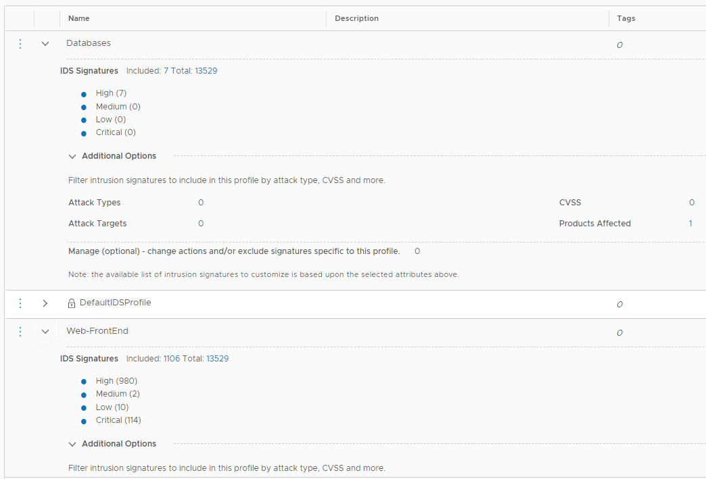

## 8. Preventing an Attack
**Estimated Time to Complete: 30 minutes**

In this exercise, we will show how the NSX Distributed IDS/IPS can just detect but also prevent an attack. We will run the same attack scenario as before.

**Tune the Web-FrontEnd Profile**

In order to prevent an attack, we need to both change the mode in our IDS/IPS rule(s) to **detect and prevent** and ensure that relevant signature actions are set to either **drop** or **reject**.
The default VMware-recommend signature action can be overrided both at the global level, or within a profile. For the purpose of this lab, we will make the modification within the profile.
Besides changing the signature action, you can also disable signatures as the global or per-profile level, which may be needed in case of false-positives.

1. In the NSX Manager UI, navigate to Security -->  Distributed IDS/IPS --> Profiles
2. Click the 3 dots icon next to the  **Web-FrontEnd** profile and then click **Edit**.
3. Click **Manage signatures for this profile**.
4. In the Filter field, select **Product Affected** and type **drupal_drupal** and click **Apply** to only show the signatures related to Drupal.


5. You should see a filtered list with 4 signatures (may be different if you have a different signature package version deployed). 
5. For each of the signatures displayed, set the Action to **Drop** or **Reject**. Click **Apply** to confirm.


6. Click **SAVE** to save the changes to the **Web-FrontEnd** profile.

**Tune the Web-FrontEnd Profile**

Now we will also set the action for signatures related to **CouchDB** in the **Databases** profile to **Drop**.

1. In the NSX Manager UI, navigate to Security -->  Distributed IDS/IPS --> Profiles
2. Click the 3 dots icon next to the  **Databasesprofile** and then click **Edit**.
3. Click **Manage signatures for this profile**.
4. You should see a filtered list with 7 signatures (may be different if you have a different signature package version deployed). 
5. Click the selection box on top to select all signatures.  
6. Click the **ACTION** button on top and choose **Drop** to change the action for all selected signatures to **Drop**. Click **Apply** to confirm.
7. Click **SAVE** to save the changes to the **Databases** profile.

**Change the IDS/IPS Mode to Detect and Prevent**

1. In the NSX Manager UI, navigate to Security -->  Distributed IDS/IPS --> Rules
2. Click **ADD POLICY**
3. Create an IDS Policy named **NSX IDPS Evaluation** .
4. Check the checkbox for the policy you just created and click **ADD RULE**.
5. Add an IDS Rule with the following parameters
    * Name **Web-Tier Policy**
    * IDS Profile **Web-FrontEnd**
    * Applied to **Web-Tier** (group)
	* Mode **Detect Only**
    * Leave other settings to defaults
6. Add another IDS Rule with the following parameters
    * Name **App-Tier Policy**
    * IDS Profile **Databases**
    * Applied to **App-Tier** (group)
		* Mode **Detect Only**
    * Leave other settings to defaults
7. Click **Publish**


Now we will also set the action for signatures related to **CouchDB** in the **Databases** profile to **Drop**.

1. In t


3.	Create a Profile with the below parameters. Click Save when done.
    * Name **Web-FrontEnd**
    * Signatures to Include: **Attack Targets**: **Web Server**
	


3.	Create another Profile with the below parameters. Click Save when done.
    * Name **Databases**
    * Signatures to Include: **Products Affected**: **apache couchdb**





**Enable IDS/IPS event logging directly from each host to a syslog collector/SIEM**

> **Note**: In addition to sending IDS/IPS Events from each distributed IDS/IPS engine, you can send them directly to a Syslog collector or SIEM from each host. Events are sent in the EVE.JSON format for which many SIEMS have pre-existing parsers/dashboards. 

In this exercise, you will learn how to conigure IDS event export from each host to your syslog collector or SIEM of choice. I will use **vRealize Log Insight**. You can use the same or your own SIEM of choice.
We will not cover how to install **vRealize Log Insight** or any other logging platform, but the following steps will cover how to send IDS/IPS evens to an aleady configured collector.

1. Login to lab vCenter and click on **Hosts and Clusters**, then select one of the 3 hosts that were deployed.
2. Click the **Configure** Tab and Scroll down to **System**. Click **Advanced System Settings**
3. Click the **Edit** button
4. In the **Filter** field, type **loghost**
5. Enter the **IP address of your syslog server** in the **Syslog.global.logHost** value field and click **OK** to confirm.

6. Repeat the same for the remaining 2 hosts.
7. Click on **Firewall** in the same **System** menu
8. Click the **Edit** button
9. In the **Filter** field, type **syslog**
10. Tick the checkbox next to **syslog** to allow outbuound syslog from the host.
11. Repeat the same for the remaining 2 hosts.

12. Open a terminal session to one of the lab hypervisors , login with **root**/**VMware1!** and execute the below commands to enable IDS log export via syslog
    * Type **nsxcli** to enter the NSX CLI on the host
    * Type **set ids engine syslogstatus enable** to enable syslog event export
    * Confirm syslog event export was succesfully enabled by running the command **get ids engine syslogstatus**

```console
[root@localhost:~] nsxcli
localhost> set ids engine syslogstatus enable
    result: success
    
localhost> get ids engine syslogstatus
       NSX IDS Engine Syslog Status Setting
--------------------------------------------------
                       true
```
13. Login to your syslog collector/SIEM and confirm you are receiving logs form each host.
14. Configure a parser or a filter to only look at IDS events. You can for example filter on the string **IDPS_EVT**. 

15. Now we will run the lateral attack scenario we used in an earlier exercise again. This time, use the pre-defined script to run the attack instead of manaully cofiguring the **Metasploit modules**.
16. Before you execute the script, if you have not previously used it, you need to ensure the IP addresses match your environment.  Utype **sudo nano attack2.rc** and replace the **RHOST** and **LHOST** IP addresses accordingly to match with the IP addresses in your environment. 
    * **RHOST** on line 3 should be the IP address of the App1-WEB-TIER VM 
    * **SUBNET** on line 6 (route add) should be the Internal Network subnet 
    * **LHOST** on line 9 should be the IP address of the External VM (this local machine) 
    * **RHOST** on line 10 should be the IP address of the App1-APP-TIER VM RHOST on line 13 should be the IP address of the App2-APP-TIER VM
17. After saving your changes, run the attack2 script by executing **sudo ./attack2.sh**.
18. Confirm a total of 3 meterpreter/command shell sessions have been established
19. Confirm your syslog server/SIEM has received the IDS events, directly from the host


This completes this exercise. Before moving to the next exercise, folow [these instructions](/docs/ClearingIDSEvents.md) to clear the IDS events from NSX Manager

---

[***Next Step: 9. Segmentation***](/docs/9-Segmentation.md)
