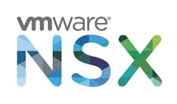

 

# NSX-T 3.1 - Distributed IDS/IPS Evaluation and Lab Guide

  

---
## Overview
The goal of this evaluation is to allow customers to get hands-on experience with the [NSX Distributed IDS/IPS](https://www.vmware.com/products/nsx-distributed-ids-ips.html). The expectation from people participating in the PoV is that they will complete the exercises outline in this guide in order to become familair with the key capabilities offered by the NSX Distributed IDS/IPS. While not the focus of this guide, particpants will also gain basic experience with the Distributed Firewall and other NSX capabilities during this evaluation process. 

While this guide is quite prescriptive, participants can choose to modify any part of the workflow as desired. The guide is primarily focused on getting customers familiar with IDS/IPS, hence **the deployment of the lab environment and rest of the configuration is automated through the use of a provided PowerShell script**. After meeting the-requisites and running the script, a fully configured nested NSX-T environment is available to particpants, including a number of attacker and victim workload which are used as part of the IDS/IPS exercises. Once the nested lab has been deployed, the lab guide walks users through a number of attack scenarios, using tools like **Metasploit** to showcase the value of the NSX Distributed IDS/IPS.
If you already have the lab deployed, you can skip module 1-4 of this guide.

## Introducing the VMware Service-defined Firewall

The VMware Service-defined firewall is VMware’s solution to secure east-to-west traffic across multi-cloud environments and is made up of 3 main components. First of all, we have our distributed firewall, which enables micro-segmentation. The distributed firewall is in essence an in kernel firewall that sits at the vNIC of every workload in the environment, enabling any level of filtering, micro-segmentation between the tiers of an application, or macro-segmentation for example isolating production from development workloads, or anything in between, completely independent of the underlying networking. Over the last few years, we’ve evolved the distributed firewall into a full Layer 7 stateful firewall.

NSX Intelligence is our distributed Visibility and analytics platform, fully integrated into NSX and provide visibility of all flows without having to rely on traditional mechanism such as Netflow or copying all traffic and also provide policy formulation which enables customers to get to full micro-segmentation much quicker. And with NSX-T 3.0 we’ve added in the distributred IDS/IPS which is based on the same distributed architecture, now for the first time, enabling customers to have a network based IDS/IPS that sits at the VNIC of every workload, with the ability to intercept every flow, without having to hairpin any traffic regardless of network connectivity.

## Introducing the NSX Distributed IDS/IPS

One of the key challenges with traditional network-based IDS/IPS solutions is that they rely on a massive amount of traffic to be hairpinned or copied across to the centralized IPS appliance. This often involves network architecture and also means that growing organizations have to continuously keep adding firewalls or IDS appliances to their centralized cluster to keep up with the growing amount of traffic that needs inspection.
Another challenge with these solutions is that they don't offer protection against lateral movement of attacks within a particular network segment. If we have two application workload deployed here in the same VLAN, there isn’t any feasible way to insert an inline IPS appliance in between these workloads and repeat that for all the workloads in your entire datacenter.
Furthermore, in virtualized datacenters, by leveraging DRS and vmotion, workloads often move to other hosts, clusters or datacenters. This means that traffic now gets redirected to another IPS appliance which has no context of existing flow and may even have a different policy applied
Finally, centralized, network based IDS/IPSes have very little understanding of the context of a flow. They just look at network traffic without known much about where the flow originated and whether or not target of an attack is potentially vulnerable. As a result, all traffic needs to be matches against several thousands of signatures. Signatures that are detecting an exploit against an vulnerability on apache are also applied to a server that runs Mysql and so on. This results in two key challenges, one being a high number of false positives which make it difficult for a security operator to distinct important events that require immediate action from all the other ones, especially if the events don’t include context about who the victim is and what’s running on that victim machine. A second challenge with having to run all traffic through all signatures is that it significantly reduces throughput. 

The NSX Distributed IDS/IPS combines some of the best qualities of host based IPS solutions with the best qualities of network bases IPS solutions to provide a radically different solution which enables Intrusion Detection and Prevention at the granularity of a workload and the scale of the entire datacenter.

Similar to the operational model of the distributed firewall, the NSX distributed IDS/IPS is deployed in the hypervisor when NSX-T is enabled on that hypervisor. It does not require the deployment of any additional appliances on that hypervisor, on the guest VM or anywhere in the network. 

Instead of hairpining traffic to a centralized IDS appliance across the network, IDS is applied right at the source or destination of the flow as it leaves a workloads or comes in. As is the case with our distributed firewall, this also means that there is need need to re-architect the network to apply IDS/IPS, and this also means that we can inspect traffic between workloads regardless of whether these workloads are the same vlan or logical segment or a different VLAN. The Distributed Firewall and IDS/IPS is applied to the traffic even before it hits the distributed switch. Almost invariably, the actual objective of an attack is not the same as where the attacker initially gained access, this means that an attacker will try to move through the environment in order to get to steal the valuable data they are after. Hence being able to not just defend against the initial attack vector, but also against lateral movement is criticial. Micro-segmentation using the distributed firewall is key in reducing the attack surface and makes lateral movement a lot more difficult, and now for the first time becomes operationally feasible to front-end each of your workloads with an Intrusion Detection and Prevention service to detect and block attempts at exploiting vulnerabilities wherever they may exist and regardless of whether the attacker is trying to gain initial access in the environment, or has already compromised a workload on the same VLAN and is now trying to move laterally to their target database on that same VLAN.

Our largest and most successful customers heavily rely on context to micro-segment their environment. They leverage security-groups based on tags and other constructs to create a policy that is tied directly to the application itself rather than to network constructs like IP addresses and ports. This same context is also a very important differentiation which solves two key challenges seen with traditional IDS and IPS solutions. First of all, because of being embedded in the hypervisor we have access to a lot more context than we could just learn by sitting on the network. We know for instance the name of each workload and, the application it’s part of and so on. VMware tools and the Guest Introspection framework can provide us with additional context such as the version of the operating system that is running on each guest and even what process or user has generated a particular flow . If a database server is known to be vulnerable to a specific vulnerability that is being exploited right now, it obviously warrants immediate attention while a network admin triggering an IPS signature by running as scan should be far less of an immediate concern.

In addition to enabling the appropriate prioritization, the same context can also be used to reduce the number of false positives, and increase the number of zero-false-positive workloads, as we have a good idea whether or not a target is potentially vulnerable, therefore reducing the amount of alerts that are often overwhelming with a traditional network-based solution. Finally, leveraging context, we can enable only the signatures that are relevant to the workloads we are protecting. If the distributed IDS instance applied to an Apache server, we can enable only the signatures that are relevant and not the vast majority of signatures that are irrelevant to this workload. This drastically reduces the performance impact seen with traditional IDS/IPS.

---
## Disclaimer and acknowledgements
This lab provides and leverages common pen-test tools including Metasploit as well as purposfully vulnerable workloads built using Vulhub (https://github.com/vulhub/vulhub) . Please only use these tools for the intended purpose of completing the PoC, isolate the lab enviornment properly from any other environment and discard when the PoC has been completed.

The automation script is based on work done by [William Lam](https://github.com/lamw) with additional vSphere and NSX automation by [Madhu Krishnarao](https://github.com/madhukark)

---
## Changelog

* **0/6/2020**
  * Intial partial draft of NSX-T 3.1 version of the guide
* **07/8/2020**
  * Intial partial draft of the guide
* **08/18/2020**
  * Intial Completed guide
---
## Intended Audience
This PoV guide is intended for existing and future NSX customers who want to evaluate the NSX Distributed IDS/IPS functionality. Ideally, the PoV process involves people covering these roles:

* CISO Representative
* Data Center Infrastructure Team
* Network Architects
* Security Architects
* Security Operations Center Analyst
* Enterprise Applicatoin Owner

---
## Resources commitment and suggested timeline
The expected time commitment to complete the evaluation process is about 6 hours. This includes the time it takes for the automated deployment of the nested lab environment. We suggest to split up this time across 2 week. The below table provides an estimate of the time it takes to complete each task:

| Task  | Estimated Time to Complete | Suggested Week | 
| ------------- | ------------- | ------------- |
| Customize Deployment Script Variables  | 30 minutes  | Week 1 | 
| Run Deployment Script  | 90 minutes | Week 1 | 
| Verify Lab Deployment  | 30 minutes | Week 1 | 
| Initial IDS/IPS Configuration  | 30 minutes | Week 2 | 
| Detecting a Simple Intrusion | 30 minutes | Week 2 | 
| Detecting an Advanced Attack | 60 minutes | Week 2 | 
| Preventing an Attack | 30 minutes | Week 2 | 

---
## Support during the PoV Process

Existing NSX customers should reach out to their NSX account team for support during the evaluation process.

---
## Table of Contents
* [Requirements](/docs/3.1/1-Requirements.md)
* [Customize Deployment Script](/docs/3.1/2-CustomizeScript.md)
* [Run Deployment Script](/docs/3.1/3-RunScript.md)
* [Verify Lab Deployment](/docs/3.1/4-VerifyDeployment.md)
* [Initial IDS/IPS Configuration](/docs/3.1/5-InitialConfiguration.md)
* [Detecting a simple Intrusion](/docs/3.1/6-DetectingASimpleIntrusion.md)
* [Detecting an Advanced Attack](/docs/3.1/7-DetectinganAdvancedAttack.md)
* [Preventing an Attack](/docs/3.1/8-PreventinganAttack.md)

[***Next Step: 1. Requirements***](docs/3.1/1-Requirements.md)
