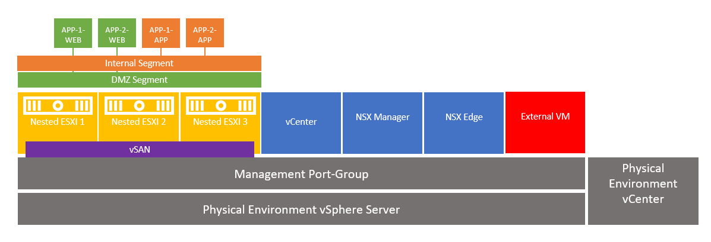
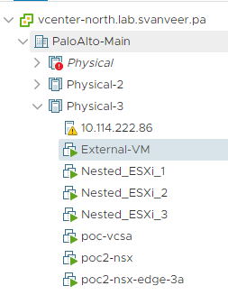
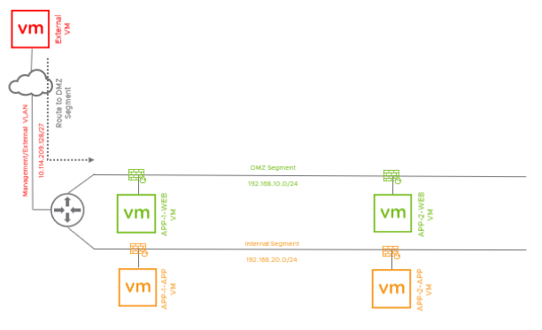
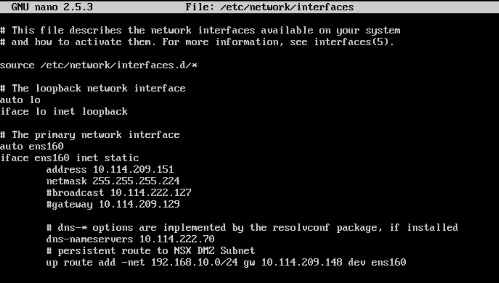
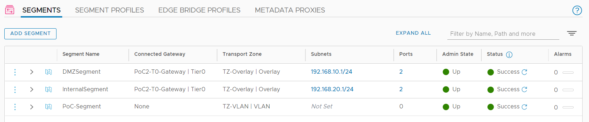
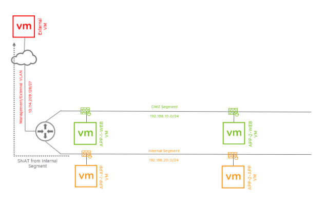
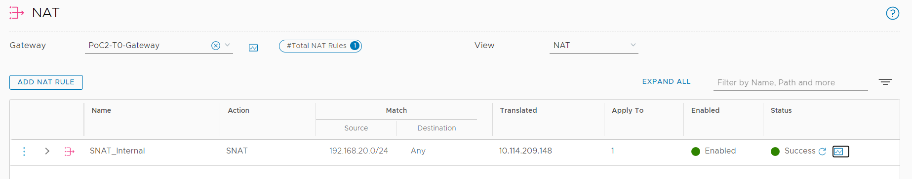

## 4. Verify Lab Deployment
**Estimated Time to Complete: 30 minutes**

Once the Deployment Script has completed the installation and setup process. Your lab environment is fully ready to start testing the NSX Distributed IDS/IPS. Verify vCenter and NSX has been configured as intended.

**Physical Infrastructure Host/vCenter**

**Logical Nested Lab**

**Validate VM Deployment in the physical Environment**

Login to the physial environment vcenter and Verify 6 VMs have been deployed, are up and running and are connected to the appropriate port-group: 
* 3 nested ESXI
* 1 NSX Manager
* 1 NSX Edge 
* 1 vCenter
* 1 External VM

Confirm you are able to ping each nested ESXi, the Lab NSX Manager and the Lab vCenter.

**Configure a static route on the External VM**

You will need to manually change the IP address of the external VM to an IP address in the same managment subnet you used for vCenter/NSX Manager and the rest of the environment. You will also need to adjust the static route so the external VM is able to reach the DMZ subnet inside the nested lab environemnt. There is no need for a default gateway to be configured as the only route the external VM needs is to the DMZ segment.

From the physical environent vCenter, open a console to **External VM** and take the following steps:
* Login with **vmware**/**VMware1!**
* Type **sudo nano /etc/network/interfaces** to open the network configuration file

* For interface **ens160** chgange the **address** and **netmask** to match the appropriate settings for your enviornment
* In the line that stats with **up route add**, change the **gw address** (10.114.209.148 in my example) to the **T0 Uplink interface IP address**
 
**Verify Nested Lab vCenter**

Login to lab vCenter and verify the cluster of 3 nested ESXi appliances is functional and 4 vulnerable VMs have been deployed on the cluster:
* APP-1-WEB-TIER connected to **DMZSegment** Portgroup
* APP-2-WEB-TIER connected to **DMZSegment** Portgroup
* APP-1-APP-TIER connected to **InternalSegment** Portgroup
* APP-2-APP-TIER connected to **InternalSegment** Portgroup

**Verify Network Segmenets were created**

1. Login to the Lab NSX Manager Web-UI.
2.	In the NSX Manager UI, navigate to Networking --> Segments --> Segments
3. Verify 3 segmetns have been deployed 
* **DMZSegment** - Overlay-based semgnet connecting the Web-tier workloads
* **InternalSegment** - OVerlay-based semgent connecting the App-tier workloads
* **PoC-Segment** - VLAN-backed segment providing uplink and management connectivity

**Determine the IP address of every nested workload**

1.	In the NSX Manager UI, navigate to Inventory -->  Virtual Machines
2. Click **View Details**
3. Note the IP addresses for the 4 VMs that were deployed. You will need to what IP address has been assigned to every workloads in the next exercises. 

> **Note**: DHCP Server has been pre-configured on NSX and should be assigning an IP address to each of the deployed nested workloads on the DMZ and Internal segments. 

**Confirm NAT configuration**

1.	In the NSX Manager UI, nativate to Networking --> NAT
2. Confirm a single **SNAT** rule exists, with the **Internal Subnet** as a source, and the **T0 Uplink** IP address as the translated address (10.114.209.148 in my example).

> **Note**: This NAT rule enables internal VMs to initiate communcation with the outside world.

**Confirm TAG Creation and Application**

1.	In the NSX Manager UI, nativate to Inventory --> Tags
2. Confirm 6 tags have been added as per below sceenshot
3. Confirm tags were applied to workloads as per below table.

---

[***Next Step: 5. Initial IDS/IPS Configuration***](/docs/5-InitialConfiguration.md)
